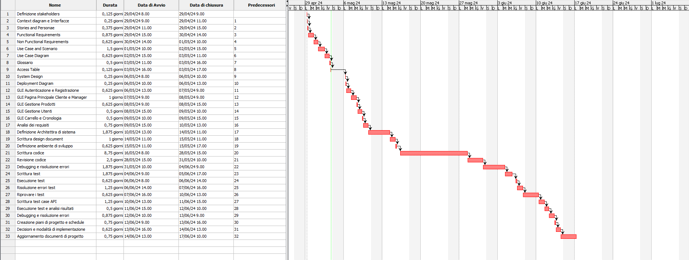

# Project Estimation - CURRENT
Date: 03/05

Version: V1

# Estimation approach
Consider the EZElectronics  project in CURRENT version (as given by the teachers), assume that you are going to develop the project INDEPENDENT of the deadlines of the course, and from scratch
# Estimate by size
### 
|             | Estimate                        |             
| ----------- | ------------------------------- |  
| NC =  Estimated number of classes to be developed   |   27 (numero di classi che si svilupperebbero )                        |             
|  A = Estimated average size per class, in LOC       |    50 (media delle linee di codice)                       | 
| S = Estimated size of project, in LOC (= NC * A) | 1350 | 
| E = Estimated effort, in person hours (here use productivity 10 LOC per person hour)  | 135                                     |   
| C = Estimated cost, in euro (here use 1 person hour cost = 30 euro) | 4050| 
| Estimated calendar time, in calendar weeks (Assume team of 4 people, 8 hours per day, 5 days per week ) |  4.2 person day                   |               

# Estimate by product decomposition
### 
|         component name    | Estimated effort (person hours)   |             
| ----------- | ------------------------------- | 
|requirement document    | 20 |
| GUI prototype | 10|
|design document | 25 |
|code | 135 |
| unit tests |30|
| api tests | 20 |
| management documents  |15|

# Estimate by activity decomposition
### 
|         Activity name    | Estimated effort (person hours)   |             
| ----------- | ------------------------------- | 
| Definizione stakeholders| 1 |
| Context Diagram e Interfacce| 2 |
| Stories and Personas| 3 |
| Functional requirements| 7 |
| Non Functional requirements| 5 |
| Use Case and Scenario | 12 |
| Use Case Diagram| 5 |
| Glossario | 4 |
| Access Table| 1 |
| System Design| 2 |
| Deployment Diagram| 2  |
| GUI Autenticazione e Registrazione | 5 |
| GUI Pagina Principale cliente e manager| 8 |
| GUI Gestione Prodotti| 5  |
| GUI Gestione Utenti | 4 |
| GUI Carrello e Cronologia| 4 |
| Analisi dei requisiti | 6 |
| Definizione architettura di sistema| 15 |
| Scrittura design document| 8 |
| Definizione ambiente di sviluppo| 5 |
| Scrittura codice| 70 |
| Revisione codice |20 |
| Debugging e risoluzione errori|  15|
| Scrittura test| 15 |
| Esecuzione test | 5 |
| Risoluzione errori test | 10  |
| Riprovare i test | 5|
| Scrittura test case API| 10 |
| Esecuzione test e analisi risultati| 4  |
| Debugging e risoluzione errori| 7 |
| Creazione piani di progetto e schedule| 6 |
| Decisioni e modalità di implementazione| 5 |
| Aggiornamento documenti del progetto|5 |

###
Insert here Gantt chart with above activities

Il Gantt diagram è stato rappresentato considerando il lavoro di una persona, in base alle attività precedentemenete indicate

# Summary

Report here the results of the three estimation approaches. The  estimates may differ. Discuss here the possible reasons for the difference

|             | Estimated effort                        |   Estimated duration |          
| ----------- | ------------------------------- | ---------------|
| estimate by size| 135 person hour |4.2 person days -> 1 settimana lavorativa |
| estimate by product decomposition | 255 person hour| 7.96 person day -> 1 settimana e 3 giorni lavorativi|
| estimate by activity decomposition | 281 person hour| 8.46 person day -> 1 settimana e 4 giorni lavorativi |

Le tre stime presentano differenze abbastanza importanti, specialmente tra l'estimation by size e le altre estimation.
L'estimation by size è stata realizzando considerando tutte le classi che devono essere realizzate per gestire le feature importanti, gli errori e le funzionalità in generale. Tale estimation considera solamente le linee di codice e non il processo di analisi dei requisiti e le varie fasi di idealizzazione.
L'estimation by product decomposition è una stima più dettagliata poichè va a considerare le varie fasi del progetto. Le varie fasi possono mostrare informazioni riguardo la gestione delle singole sezioni in maniera più precisa e con enfasi anche su eventuali problemi che si hanno in fase di sviluppo.
L'estimation by activity decomposition è la stima più dettagliata. Presenta la stima in person hour di ogni singola attività, con eventuali ritardi a causa dei vari test da rifare e problemi da risolvere. 

