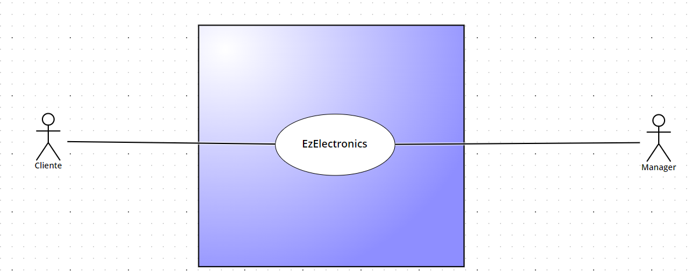
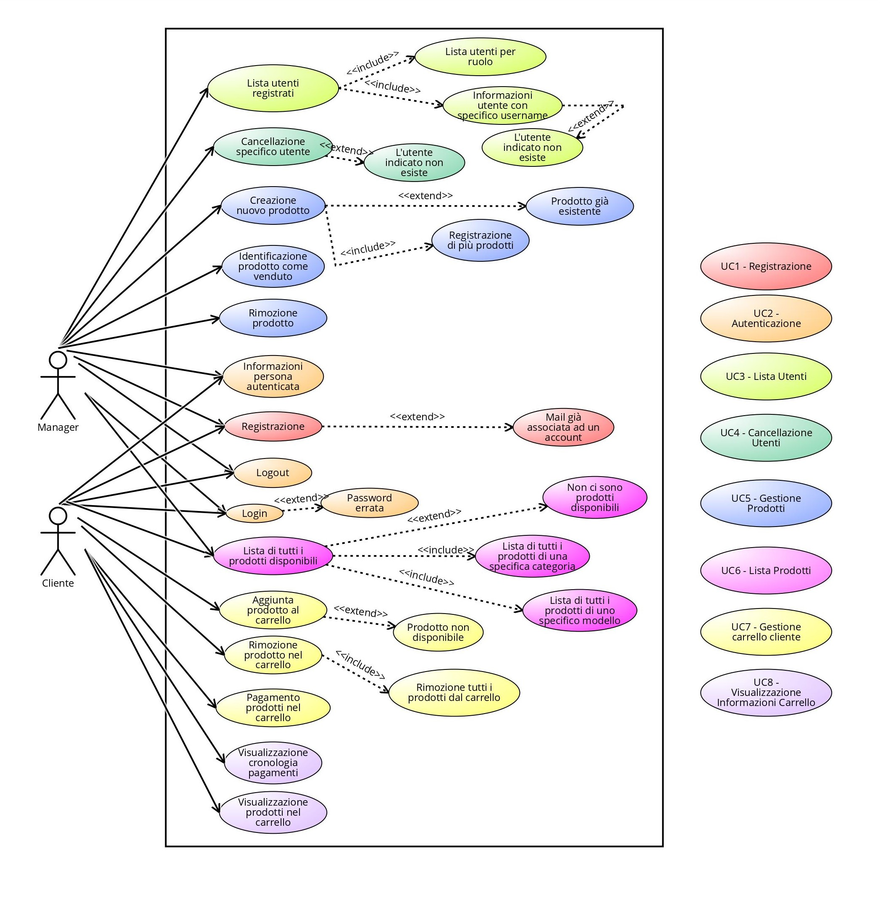
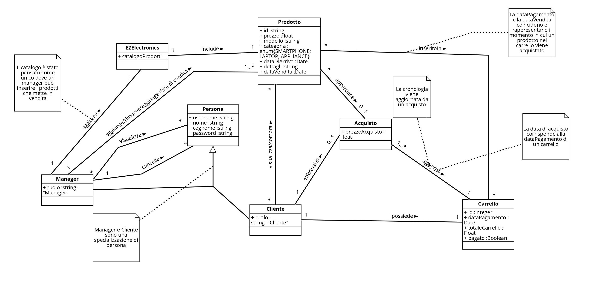
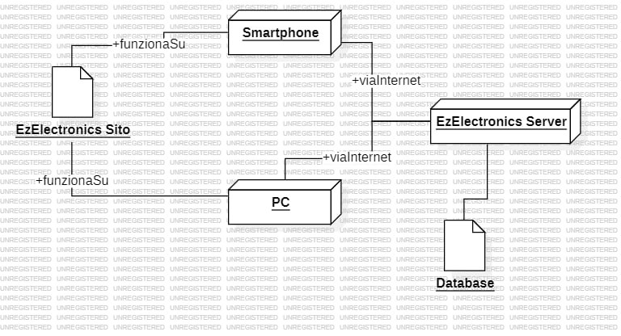

# Requirements Document - current EZElectronics

Date:

Version: V1 - description of EZElectronics in CURRENT form (as received by teachers)

| Version number | Change |
| :------------: | :----: |
|        1.3     | Bozza requisiti |

# Contents

- [Requirements Document - current EZElectronics](#requirements-document---current-ezelectronics)
- [Contents](#contents)
- [Informal description](#informal-description)
- [Stakeholders](#stakeholders)
- [Context Diagram and interfaces](#context-diagram-and-interfaces)
  - [Context Diagram](#context-diagram)
  - [Interfaces](#interfaces)
- [Stories and personas](#stories-and-personas)
- [Functional and non functional requirements](#functional-and-non-functional-requirements)
  - [Functional Requirements](#functional-requirements)
  - [Non Functional Requirements](#non-functional-requirements)
- [Use case diagram and use cases](#use-case-diagram-and-use-cases)
  - [Use case diagram](#use-case-diagram)
    - [Use case 1, UC1 - FR1 Registrazione](#use-case-1-uc1---fr1-registrazione)
      - [Scenario 1.1](#scenario-11)
      - [Scenario 1.2](#scenario-12)
    - [Use case 2, UC2 - FR1 Autenticazione](#use-case-2-uc2---fr1-autenticazione)
      - [Scenario 2.1](#scenario-21)
      - [Scenario 2.2](#scenario-22)
      - [Scenario 2.3](#scenario-23)
      - [Scenario 2.4](#scenario-24)
    - [Use case 3, UC3 -  Lista utenti](#use-case-3-uc3----lista-utenti)
      - [Scenario 3.1](#scenario-31)
      - [Scenario 3.2](#scenario-32)
      - [Scenario 3.3](#scenario-33)
      - [Scenario 3.4](#scenario-34)
    - [Use case 4, UC4 - Cancellazione utenti](#use-case-4-uc4---cancellazione-utenti)
      - [Scenario 4.1](#scenario-41)
      - [Scenario 4.2](#scenario-42)
    - [Use case 5, UC5 - Gestione Prodotti](#use-case-5-uc5---gestione-prodotti)
      - [Scenario 5.1](#scenario-51)
      - [Scenario 5.2](#scenario-52)
      - [Scenario 5.3](#scenario-53)
      - [Scenario 5.4](#scenario-54)
      - [Scenario 5.5](#scenario-55)
    - [Use case 6, UC6 - Lista Prodotti](#use-case-6-uc6---lista-prodotti)
      - [Scenario 6.1](#scenario-61)
      - [Scenario 6.2](#scenario-62)
      - [Scenario 6.3](#scenario-63)
      - [Scenario 6.4](#scenario-64)
    - [Use case 7, UC7 Gestione Carrello Cliente](#use-case-7-uc7-gestione-carrello-cliente)
      - [Scenario 7.1](#scenario-71)
      - [Scenario 7.2](#scenario-72)
      - [Scenario 7.3](#scenario-73)
      - [Scenario 7.4](#scenario-74)
      - [Scenario 7.5](#scenario-75)
    - [Use case 8, UC8 Visualizzazione Informazioni Carrello](#use-case-8-uc8-visualizzazione-informazioni-carrello)
      - [Scenario 8.1](#scenario-81)
      - [Scenario 8.2](#scenario-82)
- [Glossary](#glossary)
- [Access Table](#access-table)
- [System Design](#system-design)
- [Deployment Diagram](#deployment-diagram)

# Informal description

EZElectronics (read EaSy Electronics) is a software application designed to help managers of electronics stores to manage their products and offer them to customers through a dedicated website. Managers can assess the available products, record new ones, and confirm purchases. Customers can see available products, add them to a cart and see the history of their past purchases.

# Stakeholders

| Stakeholder name | Description |
| :--------------: | :---------: |
| Persona|  Individuo che può accedere al sito tramite registrazione o login|
| Cliente |   Persona che accede al sito con l'intento di acquistare un prodotto     |
| Manager |  Persona che gestisce il sito gestendo i prodotti |

# Context Diagram and interfaces

## Context Diagram

## Interfaces

|   Actor   | Logical Interface | Physical Interface |
| :-------: | :---------------: | :----------------: |
| Cliente |  GUI (sito versione Cliente)            |       Smartphone/ Pc |
| Manager | GUI (sito versione manager) |  PC |

# Stories and personas

Marco è il gestore di un negozio di elettronica, ha 30 anni ed è un appassionato di tecnologia desideroso di espandere le proprie vendite online e semplificare la gestione dell'inventario. Per lui è fondamentale poter inserire facilmente i prodotti disponibili nel negozio online e aggiornare lo stato dei prodotti.

Giulia è una studentessa di ingegneria elettronica di 20 anni, attualmente disoccupata, che cerca dispositivi e componenti elettronici per l'università e non.

Giovanni è un padre di famiglia, lavoratore, mezza età, che ha bisogno di trovare dei dispositivi elettronici sicuri per i suoi figli.

Marco, il Manager durante la sua giornata si occupa di gestire le vendite del negozio e ha bisogno di un modo semplice e veloce per inserire i prodotti online, soprattutto quando un prodotto è stato venduto o arrivano nuovi prodotti dai fornitori.
Deve anche poter controllare la lista dei prodotti disponibili per tenere sempre aggiornato l'inventario e cercare dei prodotti per codice quando un cliente chiede informazioni su ciò che è disponibile o per verificare la necessità di rifornirsene di nuovi.

Sara, una studentessa universitaria che passa la sua giornata in università, cerca una soluzione per trovare ciò che le serve in modo rapido, conveniente e senza complicazioni. Deve poter registrarsi facilmente e vedere la lista di tutti i prodotti disponibili. Inoltre, è importante per lei controllare la cronologia degli acquisti e pagamenti passati.

Giovanni: lavoratore impegnato durante la settimana e dedicato padre di famiglia nel weekend, si trova nella necessità di acquistare un nuovo PC per suo figlio, ma si trova di fronte alla chiusura dei negozi fisici. Vorrebbe che ci siano descrizioni dettagliate dei prodotti, comprese le specifiche.

# Functional and non functional requirements

## Functional Requirements

|  ID     | Description |
| :---:   | :---------: |
|  FR1    | Autenticazione   |
|  FR1.1  | Registrazione Cliente e manager|
|  FR1.2  | Login Cliente e manager|
|  FR1.3  | Logout Cliente e manager |
|  FR1.4  | Informazioni persona autenticata |
|  FR2    | Gestione informazioni utenti  |
|  FR2.1  | Lista di tutti gli utenti registrati   |
|  FR2.2  | Lista di utenti per ruolo specifico     |
|  FR2.3  | Informazioni Cliente con uno specifico username  |
|  FR2.4  | Cancellazione specifico Cliente dato lo username  |
|  FR3    | Gestione prodotti |
|  FR3.1  | Creazione nuovo prodotto |
|  FR3.2  | Registrazione arrivo prodotti di uno stesso modello |
|  FR3.3  | Identificazione prodotto come venduto |
|  FR3.4  | Lista di tutti i prodotti disponibili |
|  FR3.5  | Lista di tutti i prodotti di una specifica categoria |
|  FR3.6  | Lista di tutti i prodotti di uno specifico modello |
|  FR3.7  | Informazioni prodotti con uno specifico codice |
|  FR3.9  | Rimozione di uno specifico prodotto |
|  FR4    | Gestione carrello |
|  FR4.1  | Lista prodotti nel carello di un Cliente |
|  FR4.2  | Aggiunta di un prodotto al carrello |
|  FR4.3  | Pagamento in negozio dei prodotti nel carrello |
|  FR4.4  | Cronologia pagamenti effettuati|
|  FR4.5  | Rimozione prodotto dal carrello |
|  FR4.6  | Rimozione tutti i prodotti nel carrello di un Cliente |

## Non Functional Requirements

|   ID    | Type (efficiency, reliability, ..) | Description | Refers to |
| :-----: | :--------------------------------: | :---------: | :-------: |
|  NFR1      | Usabilità | Sito web dovrebbe essere intuitivo da usare per Cliente  | All FR |
|  NFR2   |  Usabilità   |  La gestione del prodotto deve essere semplice da effettuare   |   FR3   |
|  NFR3  | Efficienza | Tutte le funzionalità dovrebbero essere eseguite in < 0.5 sec  | All FR |
| NFR4 |  Affidabilità  |  Non si devono verificare più di due bug all'anno    | AllFR     |
|  NFR5     | Portabilità | Il sito deve essere compabile con le versioni aggiornate di Chrome/Edge/Opera/Mozilla( 119 e più recenti)  | All FR |
| NFR6 |  Mantenibilità  |  L'aggiunta di nuove funzionalità richiede massimo 20 person hours  | AllFR |
| NFR7 | Sicurezza |  Protezione degli account | AllFR |
| NFR8 | Dominio | I campi Username e Password devono essere non vuoti in fase di login | FR1|
| NFR9 | Dominio | In fase di registrazioni i campi Username, Nome, Cognome e Password devono essere non vuoti| FR1|
| NFR10 | Dominio | In fase di registrazioni il campo Ruolo deve essere un valore tra "Cliente" e "Manager"| FR1 |
| NFR11 | Dominio | Il prodotto deve avere un codice di almeno 6 caratteri|FR3|
| NFR12 | Dominio | Il valore della prezzo di vendita deve essere maggiore di 0| FR3|
| NFR13 | Dominio | Il campo Categoria deve contenere un valore tra "Smartphone", "Laptop", "Appliance"| FR3|
| NFR14 | Dominio | Il campo Modello non deve essere vuoto| FR3|
| NFR15 | Dominio |Il campo Data di Arrivo può essere vuoto. In tal caso viene inserita la data corrente| FR3|
| NFR16 | Dominio | Il campo Quantità deve essere un valore più grande di 0| FR3|

# Use case diagram and use cases

## Use case diagram

Tutti i scenari rappresentati degli use cases da UC3 includono la fase di input come step prerequisito.

### Use case 1, UC1 - FR1 Registrazione

| Actors Involved  |      Manager , Cliente                                                |
| :--------------: | :------------------------------------------------------------------: |
|   Precondition   |   Il sito esiste                                                     |
|  Post condition  |  Account Cliente/manager è stato creato                               |
| Nominal Scenario |   Registrazione al sito       |
|     Variants     |    -                        |
|    Exceptions    |    Mail già associata ad un account   |
                                                          

#### Scenario 1.1

|  Scenario 1.1  |          Registrazione nuovo Cliente o Manager                                       |
| :------------: | :------------------------------------------------------------------------: |
|  Precondition  |   Il sito esiste                                                           |
| Post condition |  Account Cliente/manager è stato creato                                     |
|     Step#      |                                Description                                 |
|       1        |   Utente accede al sito                                                         |
|       2        |   Utente apre sezione relativa alla registrazione                               |
|       3        |   Utente inserisce i propri dati e inserisce il proprio ruolo                   |
|       4        |   Utente conferma la richiesta di registrazione                                |
|       5        |   Il sistema conferma la registrazione e porta l'utente alla schermata principale   |  

#### Scenario 1.2

|  Scenario 1.2  |       Mail già registrata                                                  |
| :------------: | :------------------------------------------------------------------------: |
|  Precondition  |   Esiste già un account                                                    |
| Post condition |   Cliente non viene registrato                                            |
|     Step#      |                                Description                                 |
|       1        |   Utente accede al sito                                                         |
|       2        |   Utente apre la sezione relativa alla registrazione                               |
|       3        |   Utente inserisce i propri dati                                                   |
|       4        |   Utente conferma la richiesta di registrazione                                                     |
|       5        |   Il sistema mostra un messagio di errore: Mail già registrata                                    |

### Use case 2, UC2 - FR1 Autenticazione

| Actors Involved  |      Manager , Cliente                                                |
| :--------------: | :------------------------------------------------------------------: |
|   Precondition   |   L'account esiste                                                     |
|  Post condition  |   Cliente/ manager è autenticato                              |
| Nominal Scenario |   Login , Logout     |
|     Variants     |                          |
|    Exceptions    |   Password errata        |

#### Scenario 2.1

|  Scenario 2.1  |          Login                                                             |
| :------------: | :------------------------------------------------------------------------: |
|  Precondition  |   L'account esiste                                                         |
| Post condition |   Cliente/manager autenticato                                               |
|     Step#      |                                Description                                 |
|       1        |   Utente accede al sito                                                         |
|       2        |   Utente apre la sezione login                                                     |
|       3        |   Utente inserisce le credenziali                                                     |
|       4        |   Il sistema crea la sessione per il Cliente/Manager con le credenziali inserite|

#### Scenario 2.2

|  Scenario 2.2  |              Logout                                                        |
| :------------: | :------------------------------------------------------------------------: |
|  Precondition  |   Cliente/manager è autenticato                                           |
| Post condition |   Cliente/manager non è più autenticato                                   |
|     Step#      |                                Description                                 |
|       1        |   Cliente/manager clicca sul pulsante di logout                           |
|       2        |   Il sistema rimuove la sessione per il Cliente/Manager che prima era autenticato    |

#### Scenario 2.3

|  Scenario 2.3  |             Informazioni persona autenticata                               |
| :------------: | :------------------------------------------------------------------------: |
|  Precondition  |    Cliente/manager è autenticato                                          |
| Post condition |    Cliente/manger visualizzata i suoi dati personali                      |
|     Step#      |                                Description                                 |
|       1        |   Cliente/manager clicca sul pulsante "il tuo account"                    |
|       2        |   Il sistema mostra le informazioni personali dell'Cliente                         |

#### Scenario 2.4

|  Scenario 2.4  |       Password errata                                                      |
| :------------: | :------------------------------------------------------------------------: |
|  Precondition  |    Esiste già un account                                                   |
| Post condition |   Client/Manager non viene autenticato                                           |
|     Step#      |                                Description                                 |
|       1        |   Cliente/Manager accede al sito                                                         |
|       2        |   Cliente/Manager apre la sezione login                                                     |
|       3        |   Cliente/Manager inserisce le credenziali                                                     |
|       4        |   Il sistema mostra un messaggio di errore                                    |

### Use case 3, UC3 -  Lista utenti

| Actors Involved  |      Manager                                                         |
| :--------------: | :------------------------------------------------------------------: |
|   Precondition   |   Il manager ha accesso al sito                                     |
|  Post condition  | Le informazioni degli utenti sono state gestite secondo le azioni richieste |
| Nominal Scenario |  Il manager accede al sistema per avere informazioni su un Cliente |
|     Variants     |  Lista utenti per ruolo ; Visualizzazione Cliente con uno specifico username  |
|    Exceptions    | L'utente indicato non esiste |

#### Scenario 3.1

|  Scenario 3.1  |   Lista utenti registrati                        |
| :------------: | :------------------------------------------------------------------------: |
|  Precondition  |   Esiste almeno un account     |
| Post condition |   Vengono mostrati tutti gli utenti che hanno un account |
|     Step#      |                                Description                                 |
|       1        |  Il manager accede al sito   |
|       2        |  Il manager seleziona l'opzione per visualizzare la lista di tutti gli utenti          |
|       3        | Il sistema mostra la lista di tutti gli utenti                              |

#### Scenario 3.2

|  Scenario 3.2  |   Lista utenti per ruolo  specifico                     |
| :------------: | :------------------------------------------------------------------------: |
|  Precondition  |   Esiste almeno un account     |
| Post condition |   Vengono mostrati tutti gli utenti o manager a seconda del ruolo |
|     Step#      |                                Description                                 |
|       1        |  Il manager accede al sito   |
|       2        |  Il manager seleziona l'opzione per visualizzare la lista di utenti o manager          |
|       3        | Il sistema mostra la lista di tutti gli utenti per il ruolo indicato                              |

#### Scenario 3.3

|  Scenario 3.3  |   Informazioni Cliente con uno specifico username                     |
| :------------: | :------------------------------------------------------------------------: |
|  Precondition  |   Esiste l'account corrispondente     |
| Post condition |  Vengono mostrate le informazioni di quell'utenete |
|     Step#      |                                Description                                 |
|       1        |  Il manager accede al sito   |
|       2        |  Il manager seleziona l'opzione per visualizzare il Cliente con uno specifico username, inserendo lo username nella barra di ricerca degli utenti      |
|       3        | Il sistema mostra le informazioni dell'Cliente con lo username specificato           |

#### Scenario 3.4

|  Scenario 3.4  |   L'utente indicato non esiste                                      |
| :------------: | :------------------------------------------------------------------------: |
|  Precondition  |    Non esiste l'account dell' Cliente cercato    |
| Post condition |  Il manager non riesce a visualizzare alcuna informazione sugli utenti   |
|     Step#      |                                Description                                 |
|       1        |  Il manager accede al sito   |
|       3        |  Il manager cerca l'utente con il suo username       | 
|       2        |  Il sistema mostra un messaggio di errore : Nessun utente trovato                                  | 

### Use case 4, UC4 - Cancellazione utenti

| Actors Involved  |      Manager                                                         |
| :--------------: | :------------------------------------------------------------------: |
|   Precondition   |  Il manager ha accesso al sito                                     |
|  Post condition  | L'account del Cliente viene cancellato  |
| Nominal Scenario |  Il manager accede al sito per rimuovere l'account|
|     Variants     |   -                          |
|    Exceptions    | L'account selezionato non esiste |

#### Scenario 4.1

|  Scenario 4.1  |        Cancellazione specifico utente dato lo username                     |
| :------------: | :------------------------------------------------------------------------: |
|  Precondition  |   L'account dell'utente esiste                                             |
| Post condition |   L'account dell'utente è stato cancellato                                 |
|     Step#      |                                Description                                 |
|       1        |     Il manager accede al sito e si autentica                                             |
|       2        |     Il manager ricerca l'utente tramite l'username          |
|       3        |     Il manager cancella l'account dell'utente                                              |
|       4        |     Il manager conferma la richiesta                                                     |
 

#### Scenario 4.2

|  Scenario 4.2  |    L'account selezionato non esiste                                        |
| :------------: | :------------------------------------------------------------------------: |
|  Precondition  |   L'account dell'utente non esiste     |
| Post condition |   Non viene cancellato nessun account   |
|     Step#      |                                Description                                 |
|       1        |     Il manager accede al sito e si autentica  |
|       2        |     Il manager ricerca l'utente tramite l'username         |
|       3        |     Il sistema mostra un messaggio di errore                                  | 

### Use case 5, UC5 - Gestione Prodotti

| Actors Involved  |      Manager                                                         |
| :--------------: | :------------------------------------------------------------------: |
|   Precondition   |   Esistono dei prodotti                                              |
|  Post condition  |   I prodotti sono sul sito                                           |
| Nominal Scenario |   Creazione nuovo prodotto, Registrazione prodotti                                           |
|     Variants     |   Cancellazione/vendita prodotti                                     |
|    Exceptions    |   Prodotto già esistente                                             |
                                                          

#### Scenario 5.1

|  Scenario 5.1  |          Creazione nuovo prodotto                                          |
| :------------: | :------------------------------------------------------------------------: |
|  Precondition  |   I prodotto esiste                                                        |
| Post condition |   Il prodotto è stato inserito sul sito                                    |
|     Step#      |                                Description                                 |
|       1        |   Il manager accede al sito e si autentica                                               |
|       2        |   Il manager accede alla sezione relativa all'inserimento di un prodotto              |
|       3        |   Il manager inserisce la descrizione e le caratteristiche del prodotto               |
|       4        |   Il manager conferma la registrazione del prodotto    |

#### Scenario 5.2

|  Scenario 5.2  |          Registrazione arrivo nuovi prodotti dello stesso modello                                        |
| :------------: | :------------------------------------------------------------------------: |
|  Precondition  |   I prodotti esistono e devono avere stessa categoria, tipologia                                                      |
| Post condition |   I prodotti sono stati inseriti sul sito                                    |
|     Step#      |                                Description                                 |
|       1        |   Il manager accede al sito e si autentica                                            |
|       2        |   Il manager accede alla sezione relativa all'inserimento di più prodotti             |
|       3        |   Il manager inserisce il modello, la data di arrivo e la quantità di prodotti arrivati    |
|       4        |   Il manager conferma la registrazione del prodotto    |

#### Scenario 5.3

|  Scenario 5.3  |              Identificazione prodotto come venduto                         |
| :------------: | :------------------------------------------------------------------------: |
|  Precondition  |   Il prodotto è stato venduto                                              |
| Post condition |   Il prodotto è contrassegnato come venduto                                |
|     Step#      |                                Description                                 |
|       1        |   Il manager accede al sito e si autentica                                               |
|       2        |   Il manager accede alla pagina degli ordini (la sua pagina principale)                                         |
|       3        |   Il manager contrassegna il prodotto come venduto e inserisce la data di vendita                              |

#### Scenario 5.4

|  Scenario 5.4  |       Rimozione di uno specifico prodotto                                  |
| :------------: | :------------------------------------------------------------------------: |
|  Precondition  |    I prodotti esistono e sono disponibili                                  |
| Post condition |    I prodotti sono stati rimossi                                           |
|     Step#      |                                Description                                 |
|       1        |   Il manager accede al sito                                                |
|       2        |   Il manager apre la pagina relativa ai prodotti inseriti sul sito                       |
|       3        |   Il manager seleziona il prodotto specifico da eliminare                             |
|       5        |   Il manager elimina il prodotto selezionato                                          |

#### Scenario 5.5

|  Scenario 5.5  |          Prodotto già esistente    |
| :------------:|:------------------------------------------------------------------------: |
|  Precondition  |   I prodotto esiste                                                        |
| Post condition |   Il prodotto non è stato inserito sul sito                                |
|     Step#      |                                Description                                 |
|       1        |   Il manager accede al sito                                                |
|       2        |   Il manager accede alla sezione relativa all'inserimento di un prodotto              |
|       3        |   Il manager inserisce la descrizione e le caratteristiche del prodotto               |
|       4        |   Il sistema mostra un messaggio di errore: Il prodotto già esiste sul sito                     |

### Use case 6, UC6 - Lista Prodotti  

| Actors Involved  |      Manager , Cliente                                                |
| :--------------: | :------------------------------------------------------------------: |
|   Precondition   |   I prodotti sono registrati sul sito                                |
|  Post condition  |    Il Cliente visualizza i prodotti                                     |
| Nominal Scenario |   Visualizzazione prodotti disponibili                               |
|     Variants     |   Visualizzazione dei prodotti per categoria o per modello           |
|    Exceptions    |   Non ci sono prodotti disponibili                                   |

#### Scenario 6.1 

|  Scenario 6.1  |       Lista di tutti i prodotti disponibili                                |
| :------------: | :------------------------------------------------------------------------: |
|  Precondition  |    Esistono prodotti disponibili sul sito                                  |
| Post condition |    I prodotti sono stati visualizzati                                      |
|     Step#      |                                Description                                 |
|       1        |   Cliente accede al sito e si autentica                                              |
|       2        |   Cliente seleziona la lista dei prodotti                                          |
|       3        |   Il sistema mostra tutti i prodotti disponibili                                        |

#### Scenario 6.2

|  Scenario 6.2  |       Lista di tutti i prodotti di una specifica categoria                    |
| :------------: | :------------------------------------------------------------------------: |
|  Precondition  |    Esistono prodotti disponibili sul sito                                  |
| Post condition |    I prodotti sono stati visualizzati                                      |
|     Step#      |                                Description                                 |
|       1        |   Cliente accede al sito                                                    |
|       2        |   Cliente seleziona la lista dei prodotti                                          |
|       3        |   Cliente inserisce la categoria dei prodotti che vuole vedere                                        |
|     4       |   Il sistema mostra tutti i prodotti disponibili per la stessa categoria                                       |

#### Scenario 6.3

|  Scenario 6.3  |       Lista di tutti i prodotti di uno specifico modello                      |
| :------------: | :------------------------------------------------------------------------: |
|  Precondition  |    Esistono prodotti disponibili sul sito                                  |
| Post condition |    I prodotti sono stati visualizzati                                      |
|     Step#      |                                Description                                 |
|       1        |   Cliente accede al sito                                                    |
|       2        |   Cliente seleziona la lista dei prodotti                                          |
|       3        |   Cliente inserisce il modello dei prodotti che vuole vedere                                        |
|     4       |      Il sistema mostra tutti i prodotti disponibili per lo stesso modello                                       |

#### Scenario 6.4

|  Scenario 6.4  |      Non ci sono prodotti disponibili                     |
| :------------: | :------------------------------------------------------------------------: |
|  Precondition  |    Esistono prodotti disponibili sul sito                                  |
| Post condition |    I prodotti sono stati visualizzati                                      |
|     Step#      |                                Description                                 |
|       1        |   Cliente accede al sito                                                    |
|       2        |   Cliente seleziona la lista dei prodotti                                          |
|       3        |   Il sistema mostra un messaggio di errore prodotti non disponibili                             |

### Use case 7, UC7 Gestione Carrello Cliente

| Actors Involved  |      Cliente                                                |
| :--------------: | :------------------------------------------------------------------: |
|   Precondition   |  Cliente registrato e autenticato                                                     |
|  Post condition  |  Cliente ha acquistato uno o più prodotti                             |
| Nominal Scenario |  Aggiunta prodotto nel carrello; Acquisto dei prodotti nel carrello; Rimozione prodotto dal carrello    |
|     Variants     | Rimozione tutti i prodotti dal carrello                           |
|    Exceptions    |  Prodotto non disponibile|

#### Scenario 7.1 

|  Scenario 7.1  |   Aggiunta prodotto nel carrello                                          |
| :------------: | :------------------------------------------------------------------------: |
|  Precondition  |  Cliente è autenticato                                                        |
| Post condition |  Cliente ha aggiunto un prodotto nel carrello                                   |
|     Step#      |    Description                               |
|       1        |  Cliente inserisce nella barra di ricerca il nome del prodotto che vuole acquistare |
|       2        |  Cliente apre la sezione dell'elenco dei prodotti                        |
|       3        |  Cliente clicca sul pulsante con l'icona del carrello per aggiungere il prodotto nel carrello|

#### Scenario 7.2

|  Scenario 7.2  |   Pagamento prodotti nel carrello in negozio                                       |
| :------------: | :------------------------------------------------------------------------: |
|  Precondition  |  Cliente è autenticato e ha aggiunto almeno un prodotto nel carrello|
| Post condition |  Cliente ha acquistato i prodotti nel carrello                                   |
|     Step#      |  Description                              |
|       1        |  Cliente accede alla sezione del sito dedicata al carrello  |
|       2        |  Cliente preme il pulsante "Richiesta di pagamento"                      |
|       3        |  Il sistema conferma il pagamento                                |

#### Scenario 7.3

|  Scenario 7.3  |   Rimozione prodotto dal carrello                                         |
| :------------: | :------------------------------------------------------------------------: |
|  Precondition  |  Cliente è autenticato e il prodotto che vuole rimuovere dal carrello deve essere inserito nel carrello|
| Post condition |  Cliente ha rimosso il prodotto dal carrello                                  |
|     Step#      | Description                            |
|       1        |  Cliente accede alla sezione del sito dedicata al carrello  |
|       2        |  Cliente preme sul pulsante con l'icona del cestino vicino al prodotto  |

#### Scenario 7.4

|  Scenario 7.4 |   Prodotto non disponibile                                          |
| :------------: | :------------------------------------------------------------------------: |
|  Precondition  |  Cliente è autenticato                                                        |
| Post condition |  Cliente non può aggiungere un prodotto nel carrello                                   |
|     Step#      |  Description                                 |
|       1        |  Cliente inserisce nella barra di ricerca il nome del prodotto che vuole acquistare |
|       2        |  Cliente apre la sezione della lista dei prodotti                       |
|       3        |  Cliente clicca sul pulsante con l'icona del carrello per aggiungere il prodotto nel carrello|
|       4        |  Il sistema mostra un messaggio di errore: Il prodotto non è disponibile all'acquisto|

#### Scenario 7.5

|  Scenario 7.5 |   Rimozione tutti prodotti dal carrello                                         |
| :------------: | :------------------------------------------------------------------------: |
|  Precondition  |  Cliente è autenticato e il prodotto che vuole rimuovere dal carrello deve essere inserito nel carrello|
| Post condition |  Cliente ha rimosso il prodotto dal carrello                                  |
|     Step#      | Description                            |
|       1        |  Cliente accede alla sezione del sito dedicata al carrello  |
|       2        |  Cliente preme sul pulsante "Elimina tutti i prodotti dal carrello" |
|       3        | Il sistema svuota il carrello del cliente|

### Use case 8, UC8 Visualizzazione Informazioni Carrello

| Actors Involved  |      Cliente                                                |
| :--------------: | :------------------------------------------------------------------: |
|   Precondition   |  Cliente registrato e autenticato                                                     |
|  Post condition  |  Cliente ha acquistato uno o più prodotti                             |
| Nominal Scenario |  Visualizzazione prodotti nel carrello di un Cliente; Visualizzazione cronologia pagamenti;       |
|     Variants     |         |
|    Exceptions    |  |

#### Scenario 8.1

|  Scenario 8.1  |   Visualizzazione cronologia pagamenti                                        |
| :------------: | :------------------------------------------------------------------------: |
|  Precondition  |  Cliente è autenticato e ha effettuato almeno un acquisto in passato|
| Post condition |  Cliente ha visualizzato la sua cronologia dei pagamenti                              |
|     Step#      |  Description                           |
|       1        |  Cliente accede alla sezione del sito dedicata al carrello  |
|       2        |  Cliente accede alla sezione del carrello dedicata alla cronologia dei pagamenti |

#### Scenario 8.2

|  Scenario 8.2  |  Visualizzazione prodotti nel carrello di un Cliente                                     |
| :------------: | :------------------------------------------------------------------------: |
|  Precondition  |  Cliente è registrato e autenticato|
| Post condition |  Cliente ha visualizzato i prodotti nel carrello      |
|     Step#      |  Description                              |
|       1        |  Cliente accede alla sezione del sito dedicata al carrello  |
|       2        |  Il sistema mostra tutti i prodotti inseriti attualmente nel carrello|

# Glossary

- EZElectronics
  - Sito Web da cui si possono acquitare prodotti

- Prodotto
  - Oggetto in vendita sul sito, sia attualmente disponibile sia non disponibile

-  Cliente
    - Persona che può visualizzare e acquistare un prodotto dal sito e vedere la sua cronologia degli acquisti

- Manager
  - Persona che aggiunge prodotti al sito, aggiorna la lista dei prodotti disponibili e convalida gli acquisti

- Carrello
  - Insieme di oggetti che un cliente vuole acquistare e prodotti acquistati in precedenza

- Acquisto
  - Operazione di acquisto dei prodotti di un carrello con relativa data e prezzo totale

  

# Access Table

||FR1 | FR2 |FR3 | FR4 |
|----|---|---|---|---|
|Cliente| X | | | X |
|Manager|X | X| X | X |

# System Design

# Deployment Diagram

