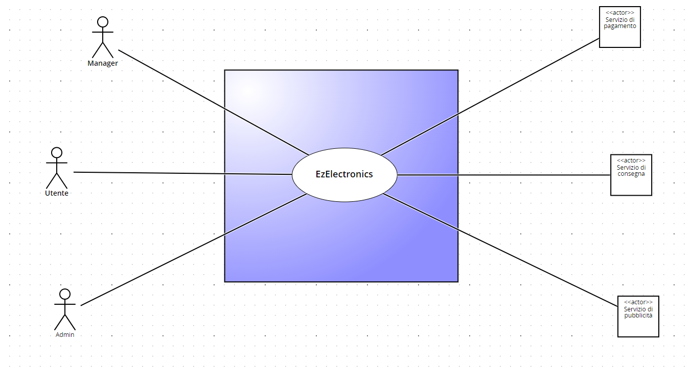
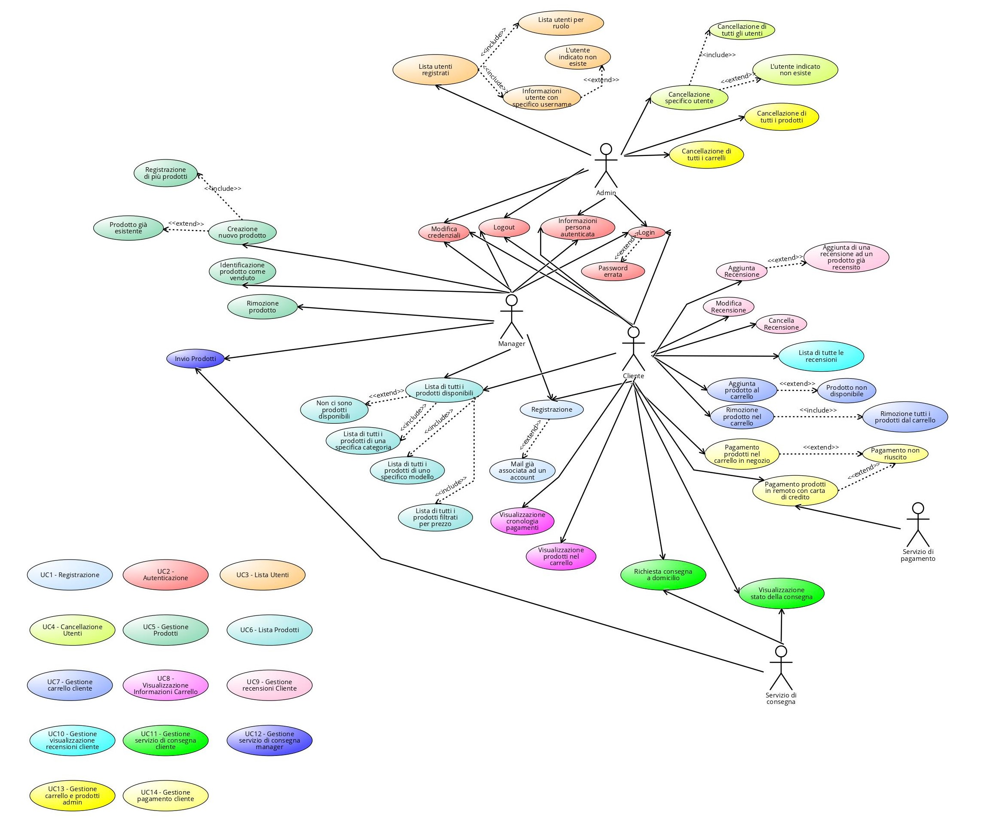
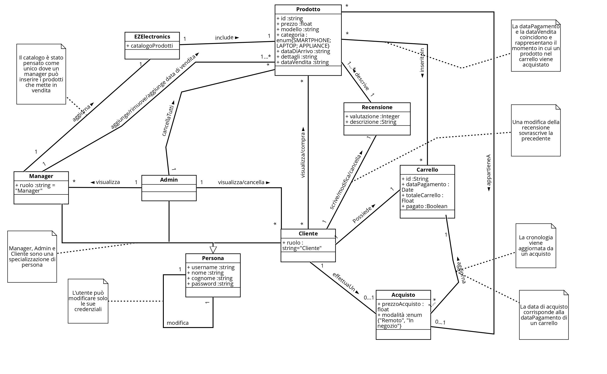
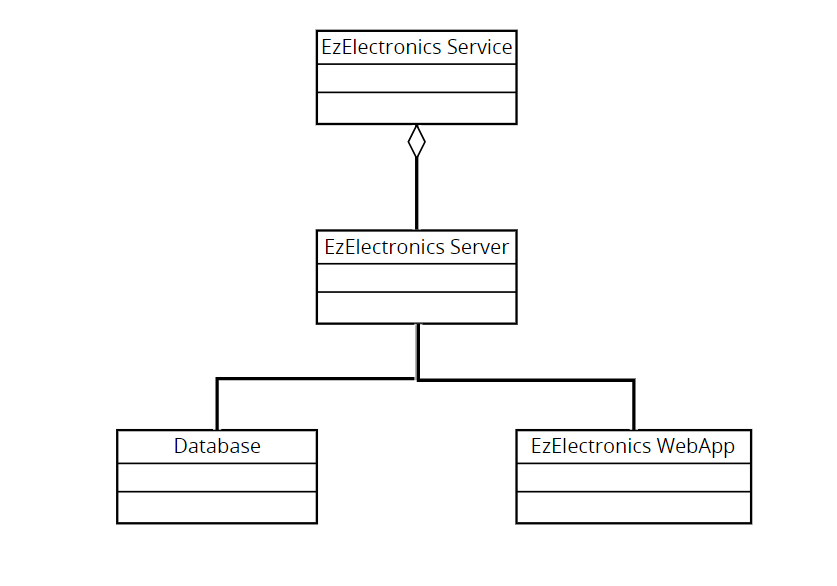

# Requirements Document - future EZElectronics

Date:

Version: V1 - description of EZElectronics in FUTURE form (as proposed by the team)

| Version number | Change |
| :------------: | :----: |
|      V1          |        |

# Contents

- [Requirements Document - future EZElectronics](#requirements-document---future-ezelectronics)
- [Contents](#contents)
- [Informal description](#informal-description)
- [Modello di business](#modello-di-business)
- [Stakeholders](#stakeholders)
- [Context Diagram and interfaces](#context-diagram-and-interfaces)
  - [Context Diagram](#context-diagram)
  - [Interfaces](#interfaces)
- [Stories and personas](#stories-and-personas)
- [Functional and non functional requirements](#functional-and-non-functional-requirements)
  - [Functional Requirements](#functional-requirements)
  - [Non Functional Requirements](#non-functional-requirements)
- [Use case diagram and use cases](#use-case-diagram-and-use-cases)
  - [Use case diagram](#use-case-diagram)
    - [Use case 1, UC1 - FR1 Registrazione](#use-case-1-uc1---fr1-registrazione)
      - [Scenario 1.1](#scenario-11)
      - [Scenario 1.2](#scenario-12)
    - [Use case 2, UC2 - FR1 Autenticazione](#use-case-2-uc2---fr1-autenticazione)
      - [Scenario 2.1](#scenario-21)
      - [Scenario 2.2](#scenario-22)
      - [Scenario 2.3](#scenario-23)
      - [Scenario 2.4](#scenario-24)
      - [Scenario 2.5](#scenario-25)
    - [Use case 3, UC3 -  Lista utenti](#use-case-3-uc3----lista-utenti)
      - [Scenario 3.1](#scenario-31)
      - [Scenario 3.2](#scenario-32)
      - [Scenario 3.3](#scenario-33)
      - [Scenario 3.4](#scenario-34)
    - [Use case 4, UC4 - Cancellazione utenti](#use-case-4-uc4---cancellazione-utenti)
      - [Scenario 4.1](#scenario-41)
      - [Scenario 4.2](#scenario-42)
      - [Scenario 4.3](#scenario-43)
    - [Use case 5, UC5 - Gestione Prodotti](#use-case-5-uc5---gestione-prodotti)
      - [Scenario 5.1](#scenario-51)
      - [Scenario 5.2](#scenario-52)
      - [Scenario 5.3](#scenario-53)
      - [Scenario 5.4](#scenario-54)
      - [Scenario 5.5](#scenario-55)
    - [Use case 6, UC6 - Lista Prodotti](#use-case-6-uc6---lista-prodotti)
      - [Scenario 6.1](#scenario-61)
      - [Scenario 6.2](#scenario-62)
      - [Scenario 6.3](#scenario-63)
      - [Scenario 6.4](#scenario-64)
      - [Scenario 6.5](#scenario-65)
    - [Use case 7, UC7 Gestione Carrello Cliente](#use-case-7-uc7-gestione-carrello-cliente)
      - [Scenario 7.1](#scenario-71)
      - [Scenario 7.2](#scenario-72)
      - [Scenario 7.3](#scenario-73)
    - [Use case 8, UC8 Visualizzazione Informazioni Carrello](#use-case-8-uc8-visualizzazione-informazioni-carrello)
      - [Scenario 8.1](#scenario-81)
      - [Scenario 8.2](#scenario-82)
    - [Use case 9, UC9 Gestione Recensioni Cliente](#use-case-9-uc9-gestione-recensioni-cliente)
      - [Scenario 9.1](#scenario-91)
      - [Scenario 9.2](#scenario-92)
    - [Scenario 9.3](#scenario-93)
    - [Scenario 9.4](#scenario-94)
    - [Use case 10, UC10 Gestione Visualizzazione Recensioni Cliente](#use-case-10-uc10-gestione-visualizzazione-recensioni-cliente)
      - [Scenario 10.1](#scenario-101)
    - [Use case 11, UC11 - FR7 Gestione servizio di consegna Cliente](#use-case-11-uc11---fr7-gestione-servizio-di-consegna-cliente)
      - [Scenario 11.1](#scenario-111)
      - [Scenario 11.2](#scenario-112)
    - [Use case 12, UC12 - FR7 Gestione servizio di consegna Manager](#use-case-12-uc12---fr7-gestione-servizio-di-consegna-manager)
      - [Scenario 12.1](#scenario-121)
    - [Use case 13, UC13 - FR4 Gestione Carrello e Prodotti Admin](#use-case-13-uc13---fr4-gestione-carrello-e-prodotti-admin)
      - [Scenario 13.1](#scenario-131)
      - [Scenario 13.2](#scenario-132)
    - [Use case 14, UC14 Gestione Pagamento Cliente](#use-case-14-uc14-gestione-pagamento-cliente)
      - [Scenario 14.1](#scenario-141)
      - [Scenario 14.2](#scenario-142)
      - [Scenario 14.3](#scenario-143)
- [Glossary](#glossary)
- [Access Table](#access-table)
- [System Design](#system-design)
- [Deployment Diagram](#deployment-diagram)

# Informal description

EZElectronics (read EaSy Electronics) is a software application designed to help managers of electronics stores to manage their products and offer them to customers through a dedicated website. Managers can assess the available products, record new ones, and confirm purchases. Customers can see available products, add them to a cart and see the history of their past purchases.

# Modello di business

Modello di business adottato prevede l'inserzione di servizi pubblicitare per la versione utente.

# Stakeholders

| Stakeholder name | Description |
| :--------------: | :---------: |
| Cliente |   Accede al sito con l'intento di acquistare un prodotto     |
| Manager |  Gestisce il sito gestendo i prodotti     |
|  Admin  | Esegue funzioni di test e gestione utenti |
| Servizio di consegna | API per la gestione delle consegne dei prodotti  |
| Servizio di pagamento| API per la gestione dei pagamenti  |
| Servizio di pubblicità | API per la gestione delle pubblicità  |

# Context Diagram and interfaces

## Context Diagram

## Interfaces

\<describe here each interface in the context diagram>

\<GUIs will be described graphically in a separate document>

|   Actor   | Logical Interface | Physical Interface |
| :-------: | :---------------: | :----------------: |
| Cliente |  GUI (sito versione utente)            |       Smartphone/ Pc             |
| Manager | GUI (sito versione manager) |  PC |
| Admin | GUI (sito versione manager) |  PC |
| Servizio di consegna | https://gls.com/ | Internet  |
| Servizio di pagamento | https://satispay.com/| Internet  |
| Servizio di pubblicità | https://developers.google.com/google-ads/api/docs/start|Internet|

# Stories and personas

Marco è il gestore di un negozio di elettronica, ha 30 anni ed è un appassionato di tecnologia desideroso di espandere le proprie vendite online e semplificare la gestione dell'inventario. Per lui è fondamentale poter inserire facilmente i prodotti disponibili nel negozio online e aggiornare lo stato dei prodotti.

Giulia è una studentessa di ingegneria elettronica di 20 anni, attualmente disoccupata, che cerca dispositivi e componenti elettronici per l'università e non.

Giovanni è un padre di famiglia, lavoratore, mezza età, che ha bisogno di trovare dei dispositivi elettronici sicuri per i suoi figli.

Giuseppe è un giovane ragazzo lavoratore che vuole comprare un nuovo smartphone, ma si basa molto sull'opinione delle persone che hanno acquistato già quei modelli.

Alberto è un recensore. Acquista vari modelli di laptop e lascia recensioni in base alla sua esperienza.

Marco, il Manager durante la sua giornata si occupa di gestire le vendite del negozio e ha bisogno di un modo semplice e veloce per inserire i prodotti online, soprattutto quando un prodotto è stato venduto o arrivano nuovi prodotti dai fornitori.
Deve anche poter controllare la lista dei prodotti disponibili per tenere sempre aggiornato l'inventario e cercare dei prodotti per codice quando un cliente chiede informazioni su ciò che è disponibile o per verificare la necessità di rifornirsene di nuovi.

Sara, una studentessa universitaria che passa la sua giornata in università, cerca una soluzione per trovare ciò che le serve in modo rapido, conveniente e senza complicazioni. Deve poter registrarsi facilmente e vedere la lista di tutti i prodotti disponili. Inoltre, è importante per lei controllare la cronologia degli acquisti e pagamenti passati.

Giovanni: lavoratore impegnato durante la settimana e dedicato padre di famiglia nel weekend, si trova nella necessità di acquistare un nuovo PC per suo figlio, ma si trova di fronte alla chiusura dei negozi fisici. Vorrebbe che ci siano descrizioni dettagliate dei prodotti, comprese le specifiche, le caratteristiche di sicurezza e l'età consigliata per valutare al meglio che un prodotto sia adatto alle sue esigenze.

Giuseppe vuole poter vedere le recensioni degli altri utenti per i smartphone che gli interessano.

Alberto vuole poter inserire le recensioni facilmente e modificarle in caso abbia commesso qualche errore di battitura. Se il prodotto testato si rivela essere difettoso, vuole poter cancellare una sua vecchia recensione.

# Functional and non functional requirements

## Functional Requirements

|  ID     | Description |
| :---:   | :---------: |
|  FR1    | Autenticazione   |
|  FR1.1  | Registrazione Cliente Manager|
|  FR1.2  | Login Cliente, Manager e Admin|
|  FR1.3  | Logout Cliente, Manager e Admin |
|  FR1.4  | Informazioni persona autenticata |
|  FR1.5  | Modifica credenziali utente |
|  FR2    | Gestione informazioni utenti  |
|  FR2.1  | Lista di tutti gli utenti registrati   |
|  FR2.2  | Lista di utenti per ruolo specifico     |
|  FR2.3  | Informazioni Cliente con uno specifico username  |
|  FR2.4  | Cancellazione specifico Cliente dato lo username  |
|  FR2.5  | Cancellazione di tutti gli utenti |
|  FR3    | Gestione prodotti |
|  FR3.1  | Creazione nuovo prodotto |
|  FR3.2  | Registrazione arrivo prodotti di uno stesso modello |
|  FR3.3  | Identificazione prodotto come venduto |
|  FR3.4  | Lista di tutti i prodotti disponibili |
|  FR3.5  | Lista di tutti i prodotti di una specifica categoria |
|  FR3.6  | Lista di tutti i prodotti di uno specifico modello |
|  FR3.7  | Lista di tutti i prodotti filtrati per prezzo |
|  FR3.7  | Informazioni prodotti con uno specifico codice |
|  FR3.8  | Rimozione di tutti i prodotti disponibili |
|  FR3.9  | Rimozione di uno specifico prodotto |
|  FR4    | Gestione carrello |
|  FR4.1  | Lista prodotti nel carello di un Cliente |
|  FR4.2  | Aggiunta di un prodotto al carrello |
|  FR4.3  | Cronologia pagamenti effettuati|
|  FR4.4  | Rimozione prodotto dal carrello |
|  FR4.5  | Rimozione tutti i prodotti nel carrello di un Cliente |
|  FR4.6  | Rimozione di tutti i prodotti di tutti i carrelli esistenti|
|  FR5    | Gestione Pagamento|
|  FR5.1  | Pagamento in negozio|
|  FR5.2  | Pagamento da remoto|
|  FR6    | Gestione Recensioni |
|  FR6.1  | Inserimento nuova recensione|
|  FR6.2  | Modifica vecchia recensione |
|  FR6.3  | Cancellazione recensione |
|  FR6.4  | Lista di tutte le recensioni di un prodotto |
|  FR7    | Gestione servizio di consegna                       |
|  FR7.1  | Richiesta consegna a domicilio        |

## Non Functional Requirements

|   ID    | Type (efficiency, reliability, ..) | Description | Refers to |
| :-----: | :--------------------------------: | :---------: | :-------: |
|  NFR1      | Usabilità | Sito web deve essere intuitivo da usare per Cliente  | All FR |
|  NFR2   |  Usabilità   |  La gestione del prodotto deve essere semplice da effettuare   |   FR3   |
|  NFR3   |  Usabilità   | Processo di pagamento guidato e sicuro     |     FR4   |
|  NFR4   | Efficienza | Tutte le funzionalità dovrebbero essere eseguite in < 0.5 sec  | All FR |
| NFR5 |  Affidabilità  |  Non si devono verificare più di due bug all'anno    | AllFR     |
|  NFR6    | Portabilità | Il sito deve essere compabile con le versioni aggiornate di Chrome/Edge/Opera/Mozilla( 119 e più recenti)  | All FR |
| NFR7 |  Mantenibilità  |  L'aggiunta di nuove funzionalità richiede massimo 20 person hours  | AllFR |
| NFR8 | Sicurezza |  Protezione degli account| AllFR |
| NFR9 | Dominio | I campi Username e Password devono essere non vuoti in fase di login | FR1|
| NF10 | Dominio | In fase di registrazioni e modifiche i campi Username, Nome, Cognome e Password devono essere non vuoti| FR1|
| NFR11 | Dominio | In fase di registrazioni il campo Ruolo deve essere un valore tra "Cliente" e "Manager"| FR1 |
| NFR12 | Dominio | Il prodotto deve avere un codice di almeno 6 caratteri|FR3|
| NFR13 | Dominio | Il valore della prezzo di vendita deve essere maggiore di 0| FR3|
| NFR14 | Dominio | Il campo Categoria deve contenere un valore tra "Smartphone", "Laptop", "Appliance"| FR3|
| NFR15 | Dominio | Il campo Modello non deve essere vuoto| FR3|
| NFR16 | Dominio |Il campo Data di Arrivo può essere vuoto. In tal caso viene inserita la data corrente| FR3|
| NFR17 | Dominio | Il campo Quantità deve essere un valore più grande di 0| FR3|
| NFR18 | Dominio | Il campo Valutazione di recensione deve essere un numero compreso tra 0 e 5| FR6|
| NFR19 | Dominio | Il campo Descrizione di recensione deve avere un massimo di 3000 caratteri | FR6|
| NFR20 | Dominio | L'utente può inserire solo una recensione per prodotto | FR6|

# Use case diagram and use cases

## Use case diagram

Tutti i scenari rappresentati degli use cases da UC3 includono la fase di input come step prerequisito.

### Use case 1, UC1 - FR1 Registrazione

| Actors Involved  |      Manager , Cliente                                                |
| :--------------: | :------------------------------------------------------------------: |
|   Precondition   |   Il sito esiste                                                     |
|  Post condition  |  Account Cliente/manager è stato creato                               |
| Nominal Scenario |   Registrazione al sito       |
|     Variants     |    -                        |
|    Exceptions    |    Mail già associata ad un account   |
                                                          

#### Scenario 1.1

|  Scenario 1.1  |          Registrazione nuovo Cliente o Manager                                       |
| :------------: | :------------------------------------------------------------------------: |
|  Precondition  |   Il sito esiste                                                           |
| Post condition |  Account Cliente/manager è stato creato                                     |
|     Step#      |                                Description                                 |
|       1        |   Utente accede al sito                                                         |
|       2        |   Utente apre sezione relativa alla registrazione                               |
|       3        |   Utente inserisce i propri dati e inserisce il proprio ruolo                   |
|       4        |   Utente conferma la richiesta di registrazione                                |
|       5        |   Il sistema conferma la registrazione e porta l'utente alla schermata principale   |  

#### Scenario 1.2

|  Scenario 1.2  |       Mail già registrata                                                  |
| :------------: | :------------------------------------------------------------------------: |
|  Precondition  |   Esiste già un account                                                    |
| Post condition |   Cliente non viene registrato                                            |
|     Step#      |                                Description                                 |
|       1        |   Utente accede al sito                                                         |
|       2        |   Utente apre la sezione relativa alla registrazione                               |
|       3        |   Utente inserisce i propri dati                                                   |
|       4        |   Utente conferma la richiesta di registrazione                                                     |
|       5        |   Il sistema mostra un messagio di errore: Mail già registrata                                    |

### Use case 2, UC2 - FR1 Autenticazione

| Actors Involved  |      Manager , Cliente, Admin                                                |
| :--------------: | :------------------------------------------------------------------: |
|   Precondition   |   L'account esiste                                                     |
|  Post condition  |   Cliente/ manager/Admin è autenticato                              |
| Nominal Scenario |   Login , Modifica autenticazione, Logout    |
|     Variants     |                        |
|    Exceptions    |   Password errata        |

#### Scenario 2.1

|  Scenario 2.1  |          Login                                                             |
| :------------: | :------------------------------------------------------------------------: |
|  Precondition  |   L'account esiste                                                         |
| Post condition |   Cliente/Manager/Admin autenticato                                               |
|     Step#      |                                Description                                 |
|       1        |   Utente accede al sito                                                         |
|       2        |   Utente apre la sezione login                                                     |
|       3        |   Utente inserisce le credenziali                                                     |
|       4        |   Il sistema crea la sessione per il Cliente/Manager/Admin con le credenziali inserite|

#### Scenario 2.2

|  Scenario 2.2  |              Logout                                                        |
| :------------: | :------------------------------------------------------------------------: |
|  Precondition  |   Cliente/Manager/Admin è autenticato                                           |
| Post condition |   Cliente/Manager/Admin non è più autenticato                                   |
|     Step#      |                                Description                                 |
|       1        |   Cliente/manager/Admin clicca sul pulsante di logout                           |
|       2        |   Il sistema rimuove la sessione per il Cliente/Manager/Admin che prima era autenticato    |

#### Scenario 2.3

|  Scenario 2.3  |             Informazioni persona autenticata                               |
| :------------: | :------------------------------------------------------------------------: |
|  Precondition  |    Cliente/manager/admin è autenticato                                          |
| Post condition |    Cliente/manger/admin visualizzata i suoi dati personali                      |
|     Step#      |                                Description                                 |
|       1        |   Cliente/manager/admin clicca sul pulsante "il tuo account"                    |
|       2        |   Il sistema mostra le informazioni personali del Cliente/Manager/Admin                         |

#### Scenario 2.4

|  Scenario 2.4  |         Modifica credenziali persona autenticata                              |
| :------------: | :------------------------------------------------------------------------: |
|  Precondition  |    Cliente/manager è autenticato                                          |
| Post condition |    Cliente/manger ha modificato le proprie credenziali                      |
|     Step#      |                                Description                                 |
|       1        |   Cliente/manager clicca sul pulsante "il tuo account"                    |
|       2        |   Il sistema mostra le informazioni personali dell'Cliente                 |
|       2        |   Cliente/Manager modifica le informazioni personali     |               

#### Scenario 2.5

|  Scenario 2.5  |       Password errata                                                      |
| :------------: | :------------------------------------------------------------------------: |
|  Precondition  |    Esiste già un account                                                   |
| Post condition |   Cliente non viene autenticato                                           |
|     Step#      |                                Description                                 |
|       1        |   Cliente/Manager/Admin accede al sito                                                         |
|       2        |   Cliente/Manager/Admin apre la sezione login                                                     |
|       3        |   Cliente/Manager/Admin inserisce le credenziali                                                     |
|       4        |   Il sistema mostra un messaggio di errore                                    |

### Use case 3, UC3 -  Lista utenti

| Actors Involved  |      Admin                                                         |
| :--------------: | :------------------------------------------------------------------: |
|   Precondition   |   L'admin ha accesso al sito                                     |
|  Post condition  | Le informazioni degli utenti sono state gestite secondo le azioni richieste |
| Nominal Scenario |  L'admin accede al sistema per avere informazioni su un Cliente |
|     Variants     |  Lista utenti per ruolo ; Visualizzazione Cliente con uno specifico username  |
|    Exceptions    |  L'utente indicato non esiste |

#### Scenario 3.1

|  Scenario 3.1  |   Lista utenti registrati                        |
| :------------: | :------------------------------------------------------------------------: |
|  Precondition  |   Esiste almeno un account Cliente/Manager     |
| Post condition |   Vengono mostrati tutti gli utenti che hanno un account |
|     Step#      |                                Description                                 |
|       1        |  L'admin accede al sito   |
|       2        |  L'admin seleziona l'opzione per visualizzare la lista di tutti gli utenti          |
|       3        |  Il sistema mostra la lista di tutti gli utenti                              |

#### Scenario 3.2

|  Scenario 3.2  |   Lista utenti per ruolo specifico                     |
| :------------: | :------------------------------------------------------------------------: |
|  Precondition  |   Esiste almeno un account Cliente/Manager    |
| Post condition |   Vengono mostrati tutti i clienti o manager a seconda del ruolo |
|     Step#      |                                Description                                 |
|       1        |  L'admin accede al sito   |
|       2        |  L'admin seleziona l'opzione per visualizzare la lista di utenti o manager          |
|       3        | Il sistema mostra la lista di tutti gli utenti per il ruolo indicato                              |

#### Scenario 3.3

|  Scenario 3.3  |   Informazioni Cliente con uno specifico username                     |
| :------------: | :------------------------------------------------------------------------: |
|  Precondition  |   Esiste l'account corrispondente     |
| Post condition |  Vengono mostrate le informazioni di quell'utenete |
|     Step#      |                                Description                                 |
|       1        |  L'admin accede al sito   |
|       2        |  L'admin seleziona l'opzione per visualizzare l'Cliente con uno specifico username        |
|       3        | Il sistema mostra le informazioni dell'Cliente con lo username specificato           |

#### Scenario 3.4

|  Scenario 3.4  |   L'utente cercato non esiste                                    |
| :------------: | :------------------------------------------------------------------------: |
|  Precondition  |    Non esiste l'account del Cliente cercato    |
| Post condition |  L'admin non riesce a visualizzare alcuna informazione sugli utenti   |
|     Step#      |                                Description                                 |
|       1        |  L'admin accede al sito   |
|       3        |  L'admin cerca l'utente con il suo username       | 
|       2        |  Il sistema mostra un messaggio di errore : Nessun utente trovato                 | 

### Use case 4, UC4 - Cancellazione utenti

| Actors Involved  |      Admin                                                        |
| :--------------: | :------------------------------------------------------------------: |
|   Precondition   |  L'admin ha accesso al sito                                     |
|  Post condition  | L'account del Cliente viene cancellato  |
| Nominal Scenario |  Cancellazione singolo utente|
|     Variants     |   Cancellazione tutti gli utenti                |
|    Exceptions    | L'account selezionato non esiste |

#### Scenario 4.1

|  Scenario 4.1  |        Cancellazione specifico Cliente dato lo username                     |
| :------------: | :------------------------------------------------------------------------: |
|  Precondition  |   L'account del Cliente esiste                                             |
| Post condition |   L'account del Cliente è stato cancellato                                 |
|     Step#      |                                Description                                 |
|       1        |     L'admin accede al sito e si autentica                                             |
|       2        |     L'admin ricerca il Cliente tramite l'username          |
|       3        |     L'admin cancella l'account dell'Cliente                                              |
|       4        |     L'admin conferma la richiesta                                                     |

#### Scenario 4.2

|  Scenario 4.2  |        Cancellazione tutti i Clienti                 |
| :------------: | :------------------------------------------------------------------------: |
|  Precondition  |   Esiste almeno un account Cliente                                          |
| Post condition |   Tutti gli utenti sono stati cancellati                                 |
|     Step#      |                                Description                                 |
|       1        |     L'admin accede al sito e si autentica                                             |
|       2        |     L'admin clicca sul pulsante "Selezione Tutti" della pagina con la lista dei Clienti         |
|       3        |     L'admin clicca sul pulsante "Elimina"                                              |
|       4        |     Il sistema cancella tutti i Clienti registrati                                                 |
 

#### Scenario 4.3

|  Scenario 4.3  |    L'account selezionato non esiste                                        |
| :------------: | :------------------------------------------------------------------------: |
|  Precondition  |   L'account del Cliente non esiste     |
| Post condition |   Non viene cancellato nessun account   |
|     Step#      |                                Description                                 |
|       1        |     L'admin accede al sito e si autentica  |
|       2        |     L'admin ricerca il Cliente tramite l'username         |
|       3        |     Il sistema mostra un messaggio di errore                                  | 

### Use case 5, UC5 - Gestione Prodotti

| Actors Involved  |      Manager                                                     |
| :--------------: | :------------------------------------------------------------------: |
|   Precondition   |   Esistono dei prodotti                                              |
|  Post condition  |   I prodotti sono sul sito                                           |
| Nominal Scenario |   Creazione nuovo prodotto, Registrazione prodotti                                           |
|     Variants     |   Cancellazione/vendita prodotti                                     |
|    Exceptions    |   Prodotto già esistente                                             |
                                                          

#### Scenario 5.1

|  Scenario 5.1  |          Creazione nuovo prodotto                                          |
| :------------: | :------------------------------------------------------------------------: |
|  Precondition  |   I prodotto esiste                                                        |
| Post condition |   Il prodotto è stato inserito sul sito                                    |
|     Step#      |                                Description                                 |
|       1        |   Il manager accede al sito e si autentica                                               |
|       2        |   Il manager accede alla sezione relativa all'inserimento di un prodotto              |
|       3        |   Il manager inserisce la descrizione e le caratteristiche del prodotto               |
|       4        |   Il manager conferma la registrazione del prodotto    |

#### Scenario 5.2

|  Scenario 5.2  |          Registrazione arrivo nuovi prodotti                                         |
| :------------: | :------------------------------------------------------------------------: |
|  Precondition  |   I prodotti esistono e devono avere stessa categoria              |
| Post condition |   I prodotti sono stati inseriti sul sito                                    |
|     Step#      |                                Description                                 |
|       1        |   Il manager accede al sito e si autentica                                            |
|       2        |   Il manager accede alla sezione relativa all'inserimento di più prodotti             |
|       3        |   Il manager inserisce la descrizione e le caratteristiche del prodotto e la quantità di prodotti arrivati    |
|       4        |   Il manager conferma la registrazione del prodotto    |

#### Scenario 5.3

|  Scenario 5.3  |              Identificazione prodotto come venduto                         |
| :------------: | :------------------------------------------------------------------------: |
|  Precondition  |   Il prodotto è stato venduto                                              |
| Post condition |   Il prodotto è contrassegnato come venduto                                |
|     Step#      |                                Description                                 |
|       1        |   Il manager accede al sito e si autentica                                               |
|       2        |   Il manager accede alla pagina dell'elenco degli ordini                                       |
|       3        |   Il manager inserisce la data di vendita del prodotto                             |
|       4        |   Il sistema contrassegna il prodotto come venduto e lo rimuove da tutti i carrelli |

#### Scenario 5.4

|  Scenario 5.4  |       Rimozione di uno specifico prodotto                                  |
| :------------: | :------------------------------------------------------------------------: |
|  Precondition  |    I prodotti esistono e sono disponibili                                  |
| Post condition |    I prodotti sono stati rimossi                                           |
|     Step#      |                                Description                                 |
|       1        |   Il manager accede al sito                                                |
|       2        |   Il manager apre la pagina relativa ai prodotti inseriti sul sito                       |
|       3        |   Il manager seleziona il prodotto specifico da eliminare                             |
|       5        |   Il manager elimina il prodotto selezionato                                          |

#### Scenario 5.5

|  Scenario 5.5  |          Prodotto già esistente   |
| :------------: | :------------------------------------------------------------------------: |
|  Precondition  |   I prodotto esiste                                                        |
| Post condition |   Il prodotto non è stato inserito sul sito                                |
|     Step#      |                                Description                                 |
|       1        |   Il manager accede al sito                                                |
|       2        |   Il manager accede alla sezione relativa all'inserimento di un prodotto              |
|       3        |   Il manager inserisce la descrizione e le caratteristiche del prodotto               |
|       4        |   Il sistema mostra un messaggio di errore: Il prodotto già esiste sul sito                     |

### Use case 6, UC6 - Lista Prodotti  

| Actors Involved  |      Manager , Cliente                                                |
| :--------------: | :------------------------------------------------------------------: |
|   Precondition   |   I prodotti sono registrati sul sito                                |
|  Post condition  |    Il Cliente visualizza i prodotti                                     |
| Nominal Scenario |   Visualizzazione prodotti disponibili                               |
|     Variants     |   Visualizzazione dei prodotti per categoria o per modello           |
|    Exceptions    |   Non ci sono prodotti disponibili                                   |

#### Scenario 6.1 

|  Scenario 6.1  |       Lista di tutti i prodotti disponibili                                |
| :------------: | :------------------------------------------------------------------------: |
|  Precondition  |    Esistono prodotti disponibili sul sito                                  |
| Post condition |    I prodotti sono stati visualizzati                                      |
|     Step#      |                                Description                                 |
|       1        |   Cliente/Manager accede alla sezione della ricerca avanzata                                      |
|       2        |   Cliente/Manager seleziona la lista dei prodotti                                          |
|       3        |   Il sistema mostra tutti i prodotti disponibili                                        |

#### Scenario 6.2 

|  Scenario 6.2  |      Lista dei prodotti filtrati per prezzo                              |
| :------------: | :------------------------------------------------------------------------: |
|  Precondition  |    Esistono prodotti disponibili sul sito                                  |
| Post condition |    I prodotti sono stati visualizzati                                      |
|     Step#      |                                Description                                 |
|       1        |   Cliente/Manager accede alla sezione della ricerca avanzata                                              |
|       2        |   Cliente/Manager seleziona un range di prezzi specifico                                  |
|       3        |   Il sistema mostra i prodotti disponibili che rispettano quel requisito             |

#### Scenario 6.3

|  Scenario 6.3  |       Lista di tutti i prodotti di una specifica categoria                    |
| :------------: | :------------------------------------------------------------------------: |
|  Precondition  |    Esistono prodotti disponibili sul sito                                  |
| Post condition |    I prodotti sono stati visualizzati                                      |
|     Step#      |                                Description                                 |
|       1        |   Cliente/Manager accede alla sezione della ricerca avanzata                                                 |
|       2        |   Cliente/Manager seleziona la lista dei prodotti                                  |
|       3        |   Cliente/Manager inserisce la categoria dei prodotti che vuole vedere             |
|     4          |   Il sistema mostra tutti i prodotti disponibili per la stessa categoria   |

#### Scenario 6.4

|  Scenario 6.4  |       Lista di tutti i prodotti di uno specifico modello                      |
| :------------: | :------------------------------------------------------------------------: |
|  Precondition  |    Esistono prodotti disponibili sul sito                                  |
| Post condition |    I prodotti sono stati visualizzati                                      |
|     Step#      |                                Description                                 |
|       1        |   Cliente/Manager accede alla sezione della ricerca avanzata                    |
|       2        |   Cliente/Manager seleziona la lista dei prodotti                                          |
|       3        |   Cliente/Manager inserisce il modello dei prodotti che vuole vedere                                        |
|        4       |      Il sistema mostra tutti i prodotti disponibili per lo stesso modello                                       |

#### Scenario 6.5

|  Scenario 6.5  |      Non ci sono prodotti disponibili                     |
| :------------: | :------------------------------------------------------------------------: |
|  Precondition  |    Esistono prodotti disponibili sul sito                                  |
| Post condition |    I prodotti sono stati visualizzati                                      |
|     Step#      |                                Description                                 |
|       1        |   Cliente/Manager accede alla sezione della ricerca avanzata                                             |
|       2        |   Cliente/Manager seleziona la lista dei prodotti                                          |
|       3        |   Il sistema mostra un messaggio di errore prodotti non disponibili                             |

### Use case 7, UC7 Gestione Carrello Cliente

| Actors Involved  |      Cliente                                                |
| :--------------: | :------------------------------------------------------------------: |
|   Precondition   |  Cliente registrato e autenticato                                                     |
|  Post condition  |  Cliente ha acquistato uno o più prodotti                             |
| Nominal Scenario |  Aggiunta prodotto nel carrello; Acquisto dei prodotti nel carrello       |
|     Variants     |  Rimozione prodotto dal carrello;                           |
|    Exceptions    |  Prodotto non disponibile, Pagamento non riusciuto|

#### Scenario 7.1 

|  Scenario 7.1  |   Aggiunta prodotto nel carrello                                          |
| :------------: | :------------------------------------------------------------------------: |
|  Precondition  |  Cliente è autenticato                                                        |
| Post condition |  Cliente ha aggiunto un prodotto nel carrello                                   |
|     Step#      |  Description                              |
|       1        |  Cliente inserisce nella barra di ricerca il nome del prodotto che vuole acquistare |
|       2        |  Cliente apre la pagina del prodotto                         |
|       3        |  Cliente clicca sul pulsante con l'icona del carrello per aggiungere il prodotto nel carrello|

#### Scenario 7.2

|  Scenario 7.2  |   Rimozione prodotto dal carrello                                         |
| :------------: | :------------------------------------------------------------------------: |
|  Precondition  |  Cliente è autenticato e il prodotto che vuole rimuovere dal carrello deve essere inserito nel carrello|
| Post condition |  Cliente ha rimosso il prodotto dal carrello                                  |
|     Step#      |  Description                            |
|       1        |  Cliente accede alla sezione del sito dedicata al carrello  |
|       2        |  Cliente preme sul pulsante con l'icona del cestino vicino al prodotto  |

#### Scenario 7.3

|  Scenario 7.3 |   Prodotto non disponibile                                          |
| :------------: | :------------------------------------------------------------------------: |
|  Precondition  |  Cliente è autenticato                                                        |
| Post condition |  Cliente non può aggiungere un prodotto nel carrello                                   |
|     Step#      |  Description                                 |
|       1        |  Cliente inserisce nella barra di ricerca il nome del prodotto che vuole acquistare |
|       2        |  Cliente apre la pagina dell'elenco dei prodotti                        |
|       3        |  Cliente clicca sul pulsante con l'icona del carrello per aggiungere il prodotto nel carrello|
|       4        |  Il sistema mostra un messaggio di errore: Il prodotto non è disponibile all'acquisto|
|       5        |  Cliente viene portato alla pagina del prodotto dal sistema|

#### Scenario 7.4

|  Scenario 7.4  |   Rimozione tutti prodotti dal carrello                                         |
| :------------: | :------------------------------------------------------------------------: |
|  Precondition  |  Cliente è autenticato e il prodotto che vuole rimuovere dal carrello deve essere inserito nel carrello|
| Post condition |  Cliente ha rimosso il prodotto dal carrello                                  |
|     Step#      | Description                            |
|       1        |  Cliente accede alla sezione del sito dedicata al carrello  |
|       2        |  Cliente preme sul pulsante "Elimina tutti i prodotti dal carrello" |
|       3        | Il sistema svuota il carrello del cliente|

### Use case 8, UC8 Visualizzazione Informazioni Carrello

| Actors Involved  |      Cliente                                                |
| :--------------: | :------------------------------------------------------------------: |
|   Precondition   |  Cliente registrato e autenticato                                                     |
|  Post condition  |  Cliente ha acquistato uno o più prodotti                             |
| Nominal Scenario |  Visualizzazione prodotti nel carrello di un Cliente; Visualizzazione cronologia pagamenti;       |
|     Variants     |         |
|    Exceptions    |  |

#### Scenario 8.1

|  Scenario 8.1  |   Visualizzazione cronologia pagamenti                                        |
| :------------: | :------------------------------------------------------------------------: |
|  Precondition  |  Cliente è autenticato e ha effettuato almeno un acquisto in passato|
| Post condition |  Cliente ha visualizzato la sua cronologia dei pagamenti                              |
|     Step#      | Description                           |
|       1        |  Cliente accede alla sezione del sito dedicata al carrello  |
|       2        |  Cliente accede alla sezione del carrello dedicata alla cronologia dei pagamenti |

#### Scenario 8.2

|  Scenario 8.2  |  Visualizzazione prodotti nel carrello di un Cliente                                     |
| :------------: | :------------------------------------------------------------------------: |
|  Precondition  |  Cliente è registrato e autenticato|
| Post condition |  Cliente ha visualizzato i prodotti nel carrello      |
|     Step#      | Description                             |
|       1        |  Cliente accede alla sezione del sito dedicata al carrello  |
|       2        |  Il sistema mostra tutti i prodotti all'interno del carrello

### Use case 9, UC9 Gestione Recensioni Cliente

| Actors Involved  |               Cliente                                     |
| :--------------: | :------------------------------------------------------------------: |
|   Precondition   |  Cliente ha acquistato il prodotto che vuole recensire      |
|  Post condition  |  Cliente ha aggiunto, modificato o cancellato una sua recensione      |
| Nominal Scenario |  Aggiunta recensione, Modifica recensione, Cancellazione recensione |
|     Variants     |  |
|    Exceptions    |  Il cliente vuole aggiungere una recensione per un prodotto che ha già recensito|

#### Scenario 9.1

|  Scenario 9.1  |  Aggiunta recensione                                        |
| :------------: | :------------------------------------------------------------------------: |
|  Precondition  |  Il cliente ha acquistato il prodotto |
| Post condition |  Il cliente ha aggiunto una recensione      |
|     Step#      |  Description    |
|       1        |  Il cliente accede alla pagina della cronologia dei suoi acquisti  |
|       2        |  Il cliente preme sul pulsante per l'aggiunta di una recensione  |
|       3        |  Il cliente compila i campi della recensione |
|       4        |  Il cliente invia la sua recensione |

#### Scenario 9.2

|  Scenario 9.2  |  Il cliente vuole aggiungere una recensione per un prodotto che ha già recensito                                       |
| :------------: | :------------------------------------------------------------------------: |
|  Precondition  |  Il cliente ha già scritto una recensione per il prodotto |
| Post condition |  Il cliente non può aggiungere un altra recensione      |
|     Step#      |  Description   |
|       1        |  Il cliente accede alla pagina della cronologia dei suoi acquisti  |
|       2        |  Il cliente preme sul pulsante per l'aggiunta di una recensione  |
|       3        |  Il sistema risponde con un messaggio di errore "recensione già inserita" |

### Scenario 9.3
| Scenario 9.3   | Cancellazione Recensione |
| :------------: | :------------------------------------------------------------------------: |
|  Precondition  |  Il cliente ha già scritto una recensione per il prodotto |
| Post condition |  Il cliente ha cancellato una sua recensione      |
|     Step#      |  Il cliente cancella una sua recensione    |
|     Step#      | Description   |
|       1        |  Il cliente accede alle informazioni del suo account|
|       2        |  Il cliente accede alla sezione "Le mie recensioni" 
|       3        |  Il cliente preme sul pulsante relativo alla cancellazione della recensione|

### Scenario 9.4

| Scenario 9.4   |  Modifica Recensione|
| :------------: | :------------------------------------------------------------------------: |
|  Precondition  |  Il cliente ha già scritto una recensione per il prodotto |
| Post condition |  Il cliente ha modificato una sua recensione      |
|     Step#      |  Il cliente modifica una sua recensione    |
|     Step#      |  Description   |
|       1        |  Il cliente accede alle informazioni del suo account|
|       2        |  Il cliente accede alla sezione "Le mie recensioni" 
|       3        |  Il cliente preme sul pulsante relativo alla recensione che vuole modificare

### Use case 10, UC10 Gestione Visualizzazione Recensioni Cliente

| Actors Involved  |               Cliente                                     |
| :--------------: | :------------------------------------------------------------------: |
|   Precondition   |  Cliente accede alla sezione del prodotto per vedere le recensioni |
|  Post condition  |  Cliente visualizza la lista delle recensioni |
| Nominal Scenario |  Lista di tutte le recensioni|
|     Variants     |   |
|    Exceptions    |  |

#### Scenario 10.1

|  Scenario 10.1  |  Lista di tutte le recensioni |
| :------------: | :------------------------------------------------------------------------: |
|  Precondition  |  Il cliente accede alla pagina del prodotto |
| Post condition |  Il cliente visualizza le recensioni     |
|     Step#      |  Description   |
|       1        |  Il cliente accede alla pagina del prodotto |
|       2        |  Il cliente accede alla sezione delle recensioni|
|       3        |  Il sistema mostra le recensioni di quel prodotto|

### Use case 11, UC11 - FR7 Gestione servizio di consegna Cliente

| Actors Involved  |  Cliente, Servizio Posizione                           |
| :--------------: | :------------------------------------------------------------------: |
|   Precondition   |   Cliente vuole effettuare un acquisto a domicilio           |
|  Post condition  |   Cliente riceve il prodotto                              |
| Nominal Scenario |   Richiesta consegna a domicilio, Visualizza stato della consegna |
|     Variants     |            |
|    Exceptions    |    |
                                                          
#### Scenario 11.1

|  Scenario 11.1  |           Richiesta consegna a domicilio                 |
| :------------: | :------------------------------------------------------------------------: |
|  Precondition  |  Cliente sta effettuando un acquisto            |
| Post condition |  Il cliente ha richiesto la consegna a domicilio                 |
|     Step#      |                                Description                                 |
|       1        |   Cliente seleziona opzione consegna a domicilio dalla pagina del carrello                 |
|       2        |  Il sistema indirizza il cliente alla pagina del servizio di consegna, dove inserisce le informazioni |  
  
#### Scenario 11.2

|  Scenario 11.2  |           Visualizzazione stato della consegna        |
| :------------: | :------------------------------------------------------------------------: |
|  Precondition  |  Cliente sta effettuando un acquisto            |
| Post condition |  il cliente ha inserito il suo indirizzo                  |
|     Step#      |                                Description                                 |
|       1        |   Cliente accede alla sezione della Cronologia del Carrello          |
|       2        |   Il cliente accede alle informazioni in tempo reale della consegna dal pulsante "Traccia Ordine" vicino ai prodotti in consegna | 

### Use case 12, UC12 - FR7 Gestione servizio di consegna Manager

| Actors Involved  |  Manager, Servizio Posizione                           |
| :--------------: | :------------------------------------------------------------------: |
|   Precondition   |   Cliente vuole effettuare un acquisto a domicilio           |
|  Post condition  |   Cliente riceve il prodotto                              |
| Nominal Scenario |   Invio prodotti; Consegna dell'ordine |
|     Variants     |    -                        |
|    Exceptions    |   Consegna non andata a buon fine   |

#### Scenario 12.1                                                      

|  Scenario 12.1  |          Invio prodotti                   |
| :------------: | :------------------------------------------------------------------------: |
|  Precondition  |   Ha effettuato un acquisto a domicilio            |
| Post condition |   L'ordine è stato spedito                  |
|     Step#      |                                Description                                 |
|       1        |   Manager segna il prodotto come venduto                  |
|       2        |   Manager preme sul pulsante " Aggiungi Tracciamento"        |
|       3        |   Il sistema comunica con il servizio di consegna per la spedizione dell'ordine e l'ordine viene spedito |

### Use case 13, UC13 - FR4 Gestione Carrello e Prodotti Admin

| Actors Involved  |      Admin                                           |
| :--------------: | :------------------------------------------------------------------: |
|   Precondition   |  Admin autenticato                                                    |
|  Post condition  |  Admin cancella tutti i carrelli |
| Nominal Scenario |  Cancellazione di tutti i carrelli, Cancellazione di tutti i prodotti |
|     Variants     |                         |
|    Exceptions    |  |

#### Scenario 13.1

|  Scenario 13.1  |  Cancellazione di tutti i carrelli                                       |
| :------------: | :------------------------------------------------------------------------: |
|  Precondition  |  Esiste almeno un carrello con almeno un prodotto|
| Post condition |  Tutti i carrelli sono vuoti  |
|     Step#      |  Description |
|       1        |  L'admin accede alla sua pagina del profilo   |
|       2        | L'admin clicca sul pulsante per la cancellazione di tutti i carrelli |
|       3        | Il sistema svuota tutti i carrelli |

#### Scenario 13.2

|  Scenario 13.2  |  Cancellazione di tutti i prodotti                                       |
| :------------: | :------------------------------------------------------------------------: |
|  Precondition  |  Esiste almeno un carrello con almeno un prodotto|
| Post condition |  Tutti i carrelli sono vuoti  |
|     Step#      |  Description   |
|       1        | L'admin accede alla sua pagina del profilo |
|       2        |  L'admin clicca sul pulsante per la cancellazione di tutti i prodotti|
|       3        | Il sistema cancella tutti i prodotti dal database |

### Use case 14, UC14 Gestione Pagamento Cliente

| Actors Involved  |      Cliente, Servizio Pagamento                                               |
| :--------------: | :------------------------------------------------------------------: |
|   Precondition   |  Cliente ha aggiunto almeno un prodotto nel carrello                                                     |
|  Post condition  |  Cliente ha acquistato uno o più prodotti                             |
| Nominal Scenario |  Pagamento prodotti in negozio, Pagamento prodotto con carta di credito |
|     Variants     |                           |
|    Exceptions    | Pagamento non riusciuto|

#### Scenario 14.1

|  Scenario 14.1  |   Pagamento prodotti nel carrello in negozio                                       |
| :------------: | :------------------------------------------------------------------------: |
|  Precondition  |  Cliente è autenticato e ha aggiunto almeno un prodotto nel carrello|
| Post condition |  Cliente ha acquistato i prodotti nel carrello                                   |
|     Step#      |  Description                              |
|       1        |  Cliente accede alla sezione del sito dedicata al carrello  |
|       2        |  Cliente preme il pulsante "Paga in negozio"                      |

#### Scenario 14.2

|  Scenario 14.2  |   Pagamento prodotti nel carrello con carta di credito                     |
| :------------: | :------------------------------------------------------------------------: |
|  Precondition  |  Cliente è autenticato e ha aggiunto almeno un prodotto nel carrello  |
| Post condition |  Cliente ha acquistato i prodotti nel carrello                                   |
|     Step#      |  Description                             |
|       1        |  Cliente accede alla sezione del sito dedicata al carrello  |
|       2        |  Cliente preme il pulsante "Paga in remoto"          |
|       3        |  Il sistema indirizza il cliente verso il sistema di pagamento |
|       4        |  Il sistema mostra un messaggio di pagamento andato a buon fine|

#### Scenario 14.3

|  Scenario 14.3  |   Pagamento non riuscito                                         |
| :------------: | :------------------------------------------------------------------------: |
|  Precondition  |  Cliente è autenticato e ha aggiunto almeno un prodotto nel carrello|
| Post condition |  Cliente non ha acquistato i prodotti nel carrello                                   |
|     Step#      | Description                              |
|       1        |  Cliente accede alla sezione del sito dedicata al carrello  |
|       2        |  Cliente preme il pulsante "Paga in remoto"  |
|       3        |  Il sistema mostra un messaggio di errore: Pagamento non riuscito |

# Glossary

- EZElectronics
  - Sito Web da cui si possono acquitare prodotti

- Catalogo
  - Insieme di prodotti disponibili

- Prodotto
  - Oggetto in vendita sul sito, sia attualmente disponibile sia non disponibile

-  Cliente
    - Persona che può visualizzare e acquistare un prodotto dal sito e vedere la sua cronologia degli acquisti

- Manager
  - Persona che aggiunge prodotti al sito, aggiorna la lista dei prodotti disponibili e convalida gli acquisti

- Admin
  - Persona che si occupa di gestire il sistema e le operazioni di testing

- Carrello
  - Insieme di oggetti che un cliente vuole acquistare

- Cronologia Acquisti
  - Insieme di oggetti acquistati in passato da un cliente

- Recensione
  - Commento con valutazione fatto da un utente verso uno specifico prodotto
  

# Access Table

||FR1 | FR2 |FR3 | FR4 | FR5| FR6|FR7|
|----|---|---|---|---|---|---|---|
|Cliente| X | | | X |X|X|X|
|Manager|X | | X | X |X|X|X|
|Admin  | X|X|X|X|

# System Design

# Deployment Diagram

