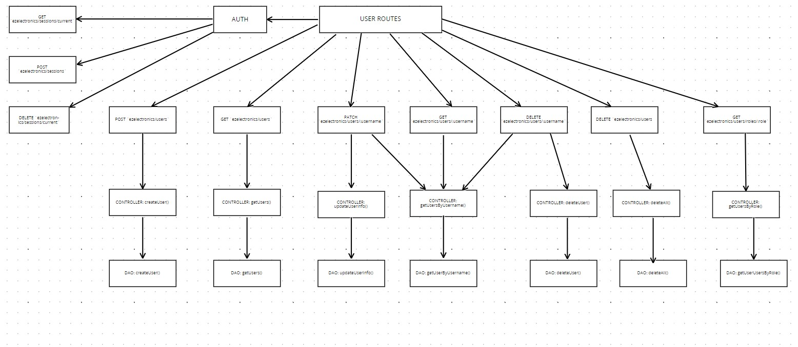
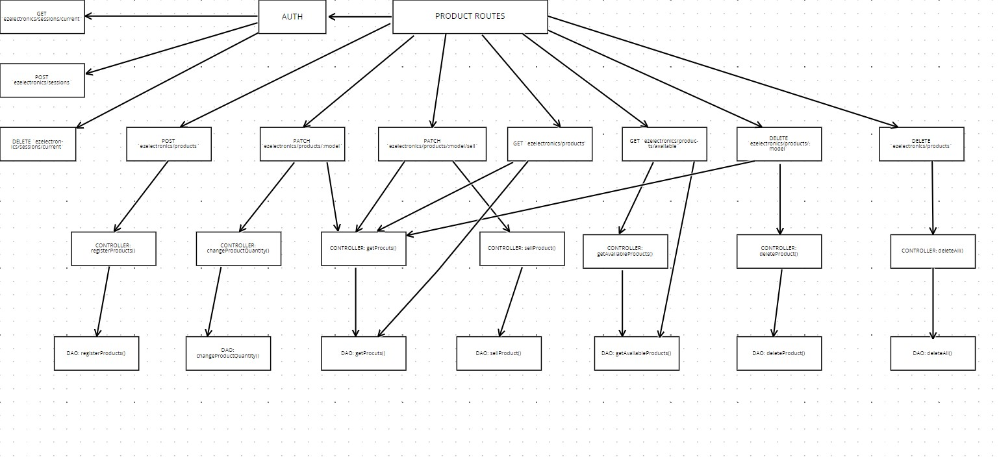
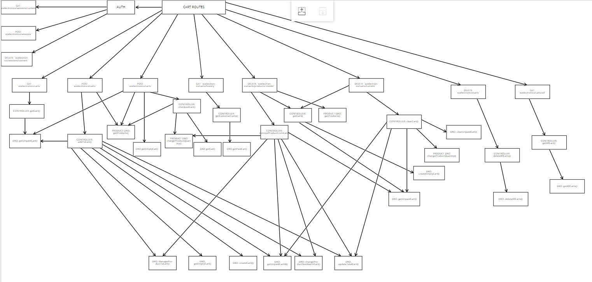
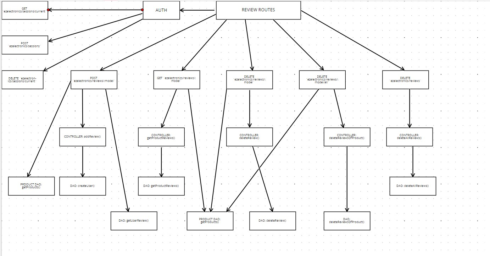
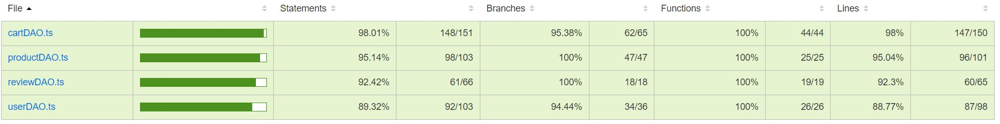
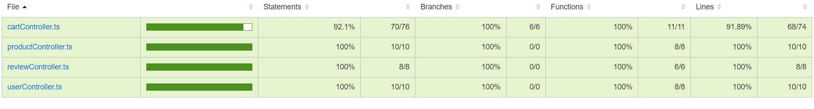
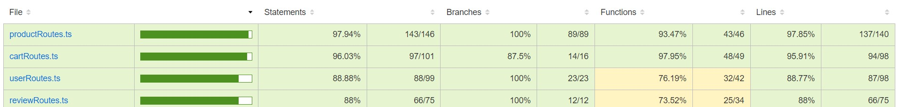
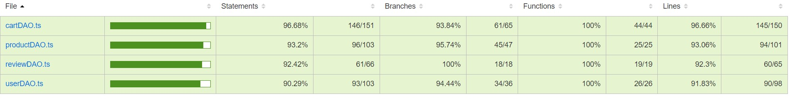
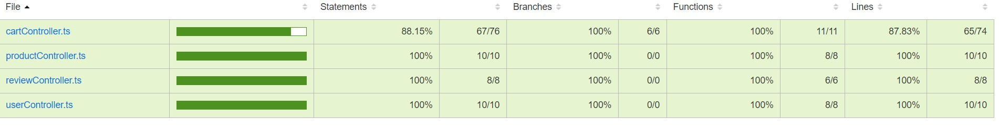
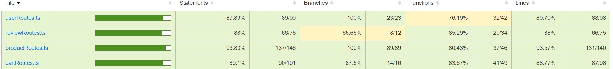

# Test Report

<The goal of this document is to explain how the application was tested, detailing how the test cases were defined and what they cover>

# Contents

- [Test Report](#test-report)
- [Contents](#contents)
- [Dependency graph](#dependency-graph)
- [Integration approach](#integration-approach)
- [Tests](#tests)
- [Coverage](#coverage)
  - [Coverage of FR](#coverage-of-fr)
  - [Coverage white box](#coverage-white-box)
      - [Unit Test Dao](#unit-test-dao)
      - [Unit Test Controller](#unit-test-controller)
      - [Unit Test Routes](#unit-test-routes)
      - [Integration Test Dao](#integration-test-dao)
      - [Integration Test Controller](#integration-test-controller)
      - [Integration Test Routes](#integration-test-routes)

# Dependency graph

   
   
   
   

# Integration approach

L'approccio usato per gli integration test è stato bottom-up. Partendo dal test tra le funzioni DAO e il database, siamo poi saliti di livello testando prima le interazioni tra i controller e la prte sottostante e infine tra le route e il resto del sistema.

L'esecuzione dei test è stata fatta dividendo i test in 4 file (uno per ogni classe) e definendo all'interno di essi prima gli integration test del DAO, poi gli integration test del Controller e infine gli integration test delle Route.

# Tests

### Table 1: DAO Tests

| Test case name                           | Object(s) tested       | Test level | Technique used           |
| :--------------------------------------: | :--------------------: | :--------: | :----------------------: |
| createUser DAO test                      | createUser             | Unit       | WB/ statement coverage   |
| GetUsers DAO test                        | getUsers               | Unit       | WB/ statement coverage   |
| getIsUserAuthenticated DAO test          | getIsUserAuthenticated | Unit       | WB/ statement coverage   |
| GetUserByUsername DAO test               | getUserByUsername      | Unit       | WB/ statement coverage   |
| GetUsersByRole DAO test                  | getUsersByRole         | Unit       | WB/ statement coverage   |
| deleteUser DAO test                      | deleteUser             | Unit       | WB/ statement coverage   |
| deleteAll DAO test                       | deleteAll              | Unit       | WB/ statement coverage   |
| updateUserInfo DAO test                  | updateUserInfo         | Unit       | WB/ statement coverage   |
| CartDAO.createCart                       | createCart             | Unit       | WB/ statement coverage   |
| CartDAO.createEmptyCart                  | createEmptyCart        | Unit       | WB/ statement coverage   |
| CartDAO.getPaidCart                      | getPaidCart            | Unit       | WB/ statement coverage   |
| CartDAO.getUnPaidCart                    | getUnPaidCart          | Unit       | WB/ statement coverage   |
| CartDAO.getUnPaidCartId                  | getUnPaidCartId        | Unit       | WB/ statement coverage   |
| CartDAO.getEmptyCart                     | getEmptyCart           | Unit       | WB/ statement coverage   |
| CartDAO.getAllCarts                      | getAllCarts            | Unit       | WB/ statement coverage   |
| CartDAO.changeProductNumberInCart        | changeProductNumberInCart | Unit    | WB/ statement coverage   |
| CartDAO.ManageProductToCart              | manageProductToCart    | Unit       | WB/ statement coverage   |
| CartDAO.updateTotalCart                  | updateTotalCart        | Unit       | WB/ statement coverage   |
| CartDAO.checkoutCart                     | checkoutCart           | Unit       | WB/ statement coverage   |
| CartDAO.clearUnpaidCart                  | clearUnpaidCart        | Unit       | WB/ statement coverage   |
| CartDAO.deleteAllCarts                   | deleteAllCarts         | Unit       | WB/ statement coverage   |
| RegisterProduct DAO test                 | registerProduct        | Unit       | WB/ statement coverage   |
| ChangeProductQuantity DAO test           | changeProductQuantity  | Unit       | WB/ statement coverage   |
| SellProduct DAO test                     | sellProduct            | Unit       | WB/ statement coverage   |
| GetProduct DAO test                      | getProduct             | Unit       | WB/ statement coverage   |
| GetAvailableProduct DAO test             | getAvailableProduct    | Unit       | WB/ statement coverage   |
| DeleteAllProduct DAO test                | deleteAllProduct       | Unit       | WB/ statement coverage   |
| Delete Product DAO test                  | deleteProduct          | Unit       | WB/ statement coverage   |
| addReview DAO test                       | addReview              | Unit       | WB/ statement coverage   |
| getProductReviews DAO test               | getProductReviews      | Unit       | WB/ statement coverage   |
| getUserReview DAO test                   | getUserReview          | Unit       | WB/ statement coverage   |
| ReviewDAO deleteReview Tests             | deleteReview           | Unit       | WB/ statement coverage   |
| ReviewDAO deleteReviewsOfProduct Tests   | deleteReviewsOfProduct | Unit       | WB/ statement coverage   |
| ReviewDAO deleteAllReviews Tests         | deleteAllReviews       | Unit       | WB/ statement coverage   |

### Table 2: Controller Tests

| Test case name                           | Object(s) tested       | Test level | Technique used           |
| :--------------------------------------: | :--------------------: | :--------: | :----------------------: |
| CartController.addToCart                 | addToCart              | Unit       | WB/ statement coverage   |
| CartController.getCart                   | getCart                | Unit       | WB/ statement coverage   |
| CartController.checkoutCart              | checkoutCart           | Unit       | WB/ statement coverage   |
| CartController.getCustomerCarts          | getCustomerCarts       | Unit       | WB/ statement coverage   |
| CartController.removeProductFromCart     | removeProductFromCart  | Unit       | WB/ statement coverage   |
| CartController.clearCart                 | clearCart              | Unit       | WB/ statement coverage   |
| CartControllers.deleteAllCarts           | deleteAllCarts         | Unit       | WB/ statement coverage   |
| CartControllers.getAllCarts              | getAllCarts            | Unit       | WB/ statement coverage   |
| ProductController.RegisterProducts       | registerProducts       | Unit       | WB/ statement coverage   |
| ProductController.ChangeProductQuantity  | changeProductQuantity  | Unit       | WB/ statement coverage   |
| ProductController.SellProduct            | sellProduct            | Unit       | WB/ statement coverage   |
| ProductController.GetProducts            | getProducts            | Unit       | WB/ statement coverage   |
| ProductController.GetAvailableProducts   | getAvailableProducts   | Unit       | WB/ statement coverage   |
| ProductController.DeleteAllProducts      | deleteAllProducts      | Unit       | WB/ statement coverage   |
| ProductController.Delete a Product       | deleteProduct          | Unit       | WB/ statement coverage   |
| ReviewController.addReview               | addReview              | Unit       | WB/ statement coverage   |
| ReviewController.getProductReviews       | getProductReviews      | Unit       | WB/ statement coverage   |
| ReviewController.deleteReview            | deleteReview           | Unit       | WB/ statement coverage   |
| ReviewController.deleteReviewsOfProduct  | deleteReviewsOfProduct | Unit       | WB/ statement coverage   |
| ReviewController.deleteAllReviews        | deleteAllReviews       | Unit       | WB/ statement coverage   |
| UserController.createUser                | createUser             | Unit       | WB/ statement coverage   |
| UserController.getUsers                  | getUsers               | Unit       | WB/ statement coverage   |
| UserController.getUsersByRole            | getUsersByRole         | Unit       | WB/ statement coverage   |
| UserController.getUserByUsername         | getUserByUsername      | Unit       | WB/ statement coverage   |
| UserController.deleteUser                | deleteUser             | Unit       | WB/ statement coverage   |
| UserController.deleteAll                 | deleteAll              | Unit       | WB/ statement coverage   |
| UserController.updateUserInfo            | updateUserInfo         | Unit       | WB/ statement coverage   |

### Table 3: Route Tests

| Test case name                            | Object(s) tested              | Test level | Technique used           |
| :---------------------------------------: | :---------------------------: | :--------: | :----------------------: |
| Product Route Tests.Inserisci nuovo prodotto   | inserisciNuovoProdotto       | Unit       | WB/ statement coverage   |
| Product Route Tests.Modifica quantità prodotto | modificaQuantitaProdotto    | Unit       | WB/ statement coverage   |
| Product Route Tests.Route Vendita prodotto     | VenditaProdotto        | Unit       | WB/ statement coverage   |
| Product Route Tests.Route Get Products         | GetProducts            | Unit       | WB/ statement coverage   |
| Product Route Tests.Route Get Available Products | GetAvailableProducts | Unit       | WB/ statement coverage   |
| Product Route Tests.Route Cancellazione tutti prodotti | CancellazioneTuttiProdotti | Unit       | WB/ statement coverage   |
| Product Route Tests.Route Cancellazione prodotto | CancellazioneProdotto | Unit       | WB/ statement coverage   |
| Review Routes.POST /:model                  | postModel                   | Unit       | WB/ statement coverage   |
| Review Routes.GET /:model                   | getModel                    | Unit       | WB/ statement coverage   |
| Review Routes.DELETE /:model                | deleteModel                 | Unit       | WB/ statement coverage   |
| Review Routes.DELETE /:model/all            | deleteModelAll              | Unit       | WB/ statement coverage   |
| Review Routes.DELETE /                      | deleteAll                   | Unit       | WB/ statement coverage   |
| Cart Routes.Ottenere il carrello dell'utente | ottienereCarrelloUtente     | Unit       | WB/ statement coverage   |
| Cart Routes.Aggiungere un prodotto al carrello | aggiungereProdottoCarrello | Unit       | WB/ statement coverage   |
| Cart Routes.Checkout carrello               | checkoutCarrello            | Unit       | WB/ statement coverage   |
| Cart Routes.Cronologia Carrelli             | cronologiaCarrelli          | Unit       | WB/ statement coverage   |
| Cart Routes.Rimuovere un prodotto dal carrello | rimuovereProdottoCarrello | Unit       | WB/ statement coverage   |
| Cart Routes.Svuotare il carrello            | svuotareCarrello            | Unit       | WB/ statement coverage   |
| Cart Routes.Rimuovere tutti i carrelli      | rimuovereTuttiCarrelli      | Unit       | WB/ statement coverage   |
| Cart Routes.Ottieni tutti i carrelli        | ottieniTuttiCarrelli        | Unit       | WB/ statement coverage   |
| Route unit tests.POST /users                | postUsers                   | Unit       | WB/ statement coverage   |
| Route unit tests.GET /users                 | getUsers                    | Unit       | WB/ statement coverage   |
| Route unit tests.DELETE /users/:username    | deleteUserByUsername        | Unit       | WB/ statement coverage   |
| Route unit tests.GET /users/roles/:role     | getUsersByRole              | Unit       | WB/ statement coverage   |
| Route unit tests.GET /users/:username       | getUserByUsername           | Unit       | WB/ statement coverage   |
| Route unit tests.DELETE /users              | deleteAllUsers              | Unit       | WB/ statement coverage   |
| Route unit tests.PATCH /users/:username     | patchUserByUsername         | Unit       | WB/ statement coverage   |
| Route unit tests.DELETE /sessions/          | deleteSessions              | Unit       | WB/ statement coverage   |
| Route unit tests.POST /sessions             | postSessions                | Unit       | WB/ statement coverage   |
| Route unit tests.GET /sessions/current      | getSessionsCurrent          | Unit       | WB/ statement coverage   |

### Table 4: Integration Test DAO Carts

| Test case name                          | Object(s) tested                   | Test level   | Technique used            |
| :-------------------------------------: | :--------------------------------: | :----------: | :-----------------------: |
| Integration Test DAO Carts.Create a new cart | createNewCart                     | Integration  | WB/ statement coverage    |
| Integration Test DAO Carts.Create Empty Cart | createEmptyCart                   | Integration  | WB/ statement coverage    |
| Integration Test DAO Carts.GetPaidCart   | getPaidCart                        | Integration  | WB/ statement coverage    |
| Integration Test DAO Carts.GetUnpaidCart | getUnpaidCart                      | Integration  | WB/ statement coverage    |
| Integration Test DAO Carts.GetUnpaidCartId | getUnpaidCartId                   | Integration  | WB/ statement coverage    |
| Integration Test DAO Carts.GetEmptyCart  | getEmptyCart                       | Integration  | WB/ statement coverage    |
| Integration Test DAO Carts.getAllCarts   | getAllCarts                        | Integration  | WB/ statement coverage    |
| Integration Test DAO Carts.changeProductNumberInCart | changeProductNumberInCart       | Integration  | WB/ statement coverage    |
| Integration Test DAO Carts.UpdateTotalCart | updateTotalCart                   | Integration  | WB/ statement coverage    |
| Integration Test DAO Carts.ManageProductToCart | manageProductToCart              | Integration  | WB/ statement coverage    |
| Integration Test DAO Carts.CheckoutCart  | checkoutCart                       | Integration  | WB/ statement coverage    |
| Integration Test DAO Carts.clearUnpaidCart | clearUnpaidCart                   | Integration  | WB/ statement coverage    |
| Integration Test DAO Carts.DeleteAllCarts | deleteAllCarts                     | Integration  | WB/ statement coverage    |

### Table 5: Integration Test DAO Products

| Test case name                          | Object(s) tested                   | Test level   | Technique used            |
| :-------------------------------------: | :--------------------------------: | :----------: | :-----------------------: |
| Integration Test DAO Products.Register a product | registerProduct               | Integration  | WB/ statement coverage    |
| Integration Test DAO Products.Change Product Quantity | changeProductQuantity         | Integration  | WB/ statement coverage    |
| Integration Test DAO Products.Sell Product | sellProduct                      | Integration  | WB/ statement coverage    |
| Integration Test DAO Products.Get Products | getProducts                       | Integration  | WB/ statement coverage    |
| Integration Test DAO Products.Get Available Products | getAvailableProducts         | Integration  | WB/ statement coverage    |
| Integration Test DAO Products.Delete All Products | deleteAllProducts              | Integration  | WB/ statement coverage    |
| Integration Test DAO Products.Delete Product | deleteProduct                   | Integration  | WB/ statement coverage    |

### Table 6: Integration Test DAO Users

| Test case name                          | Object(s) tested                   | Test level   | Technique used            |
| :-------------------------------------: | :--------------------------------: | :----------: | :-----------------------: |
| Integration Test DAO Users.getIsUserAuthenticated | getIsUserAuthenticated         | Integration  | WB/ statement coverage    |
| Integration Test DAO Users.createUser   | createUser                         | Integration  | WB/ statement coverage    |
| Integration Test DAO Users.GetUserByUsername | getUserByUsername               | Integration  | WB/ statement coverage    |
| Integration Test DAO Users.GetUsers     | getUsers                           | Integration  | WB/ statement coverage    |
| Integration Test DAO Users.getUsersByRole | getUsersByRole                   | Integration  | WB/ statement coverage    |
| Integration Test DAO Users.deleteUser   | deleteUser                         | Integration  | WB/ statement coverage    |
| Integration Test DAO Users.deleteAll    | deleteAll                          | Integration  | WB/ statement coverage    |
| Integration Test DAO Users.updateUserInfo | updateUserInfo                   | Integration  | WB/ statement coverage    |

### Table 7: Integration Test DAO Reviews

| Test case name                          | Object(s) tested                   | Test level   | Technique used            |
| :-------------------------------------: | :--------------------------------: | :----------: | :-----------------------: |
| Integration Test DAO Reviews.Add Review | addReview                          | Integration  | WB/ statement coverage    |
| Integration Test DAO Reviews.Get Product Reviews | getProductReviews            | Integration  | WB/ statement coverage    |
| Integration Test DAO Reviews.Get User Review | getUserReview                   | Integration  | WB/ statement coverage    |
| Integration Test DAO Reviews.Delete Review | deleteReview                     | Integration  | WB/ statement coverage    |
| Integration Test DAO Reviews.Delete product reviews | deleteProductReviews         | Integration  | WB/ statement coverage    |
| Integration Test DAO Reviews.Delete all reviews | deleteAllReviews               | Integration  | WB/ statement coverage    |

### Table 8: Integration Test Controller Carts

| Test case name                          | Object(s) tested                   | Test level   | Technique used            |
| :-------------------------------------: | :--------------------------------: | :----------: | :-----------------------: |
| Integration Test Controller Carts.Create a new cart | createNewCart                 | Integration  | WB/ statement coverage    |
| Integration Test Controller Carts.GetCart | getCart                             | Integration  | WB/ statement coverage    |
| Integration Test Controller Carts.CheckoutCart | checkoutCart                     | Integration  | WB/ statement coverage    |
| Integration Test Controller Carts.GetPaidCart | getPaidCart                       | Integration  | WB/ statement coverage    |
| Integration Test Controller Carts.RemoveProductFromCart | removeProductFromCart       | Integration  | WB/ statement coverage    |
| Integration Test Controller Carts.ClearCart | clearCart                           | Integration  | WB/ statement coverage    |
| Integration Test Controller Carts.DeleteAllCarts | deleteAllCarts                   | Integration  | WB/ statement coverage    |
| Integration Test Controller Carts.GetAllCarts | getAllCarts                       | Integration  | WB/ statement coverage    |

### Table 9: Integration Test Controller Products

| Test case name                          | Object(s) tested                   | Test level   | Technique used            |
| :-------------------------------------: | :--------------------------------: | :----------: | :-----------------------: |
| Integration Test Controller Products.Register a product | registerProduct             | Integration  | WB/ statement coverage    |
| Integration Test Controller Products.Change Product Quantity | changeProductQuantity     | Integration  | WB/ statement coverage    |
| Integration Test Controller Products.Sell Product | sellProduct                    | Integration  | WB/ statement coverage    |
| Integration Test Controller Products.Get Products | getProducts                     | Integration  | WB/ statement coverage    |
| Integration Test Controller Products.Get Available Products | getAvailableProducts       | Integration  | WB/ statement coverage    |
| Integration Test Controller Products.Delete All Products | deleteAllProducts            | Integration  | WB/ statement coverage    |
| Integration Test Controller Products.Delete Product | deleteProduct                 | Integration  | WB/ statement coverage    |

### Table 10: Integration Test Controller Users

| Test case name                          | Object(s) tested                   | Test level   | Technique used            |
| :-------------------------------------: | :--------------------------------: | :----------: | :-----------------------: |
| Integration Test Controller Users.createUser | createUser                       | Integration  | WB/ statement coverage    |
| Integration Test Controller Users.getUsers | getUsers                           | Integration  | WB/ statement coverage    |
| Integration Test Controller Users.getUsersByRole | getUsersByRole                 | Integration  | WB/ statement coverage    |
| Integration Test Controller Users.getUserByUsername | getUserByUsername           | Integration  | WB/ statement coverage    |
| Integration Test Controller Users.deleteUser | deleteUser                       | Integration  | WB/ statement coverage    |
| Integration Test Controller Users.deleteAll | deleteAll                         | Integration  | WB/ statement coverage    |
| Integration Test Controller Users.updateUserInfo | updateUserInfo                 | Integration  | WB/ statement coverage    |

### Table 11: Integration Test Controller Reviews

| Test case name                          | Object(s) tested                   | Test level   | Technique used            |
| :-------------------------------------: | :--------------------------------: | :----------: | :-----------------------: |
| Integration Test Controller Reviews.Add Review | addReview                       | Integration  | WB/ statement coverage    |
| Integration Test Controller Reviews.Get Product Reviews | getProductReviews           | Integration  | WB/ statement coverage    |
| Integration Test Controller Reviews.delete a review | deleteReview                  | Integration  | WB/ statement coverage    |
| Integration Test Controller Reviews.Delete all review of a product | deleteProductReviews    | Integration  | WB/ statement coverage    |
| Integration Test Controller Reviews.Delete all reviews | deleteAllReviews              | Integration  | WB/ statement coverage    |

### Table 12: Integration Test Route Carts

| Test case name                               | Object(s) tested                   | Test level   | Technique used   |
| -------------------------------------------- | --------------------------------- | ------------ | ---------------- |
| Integration Test Route Carts GET /carts                                   | Retrieve carts                    | Integration  | WB/Statement coverage    |
| Integration Test Route Carts POST /carts                                  | Create cart                       | Integration  | WB/Statement coverage    |
| Integration Test Route Carts Patch /carts                                 | Update cart                       | Integration  | WB/Statement coverage    |
| Integration Test Route Carts GET history                                  | Retrieve cart history             | Integration  | WB/Statement coverage    |
| Integration Test Route Carts DELETE /carts/:model                         | Delete specific cart              | Integration  | WB/Statement coverage   |
| Integration Test Route Carts DELETE /current                              | Delete current cart               | Integration  | WB/Statement coverage    |
| Integration Test Route Carts Delete all carts                             | Delete all carts                  | Integration  | WB/Statement coverage    |
| Integration Test Route Carts Get all carts                                | Retrieve all carts                | Integration  | WB/Statement coverage     |

### Table 14: Integration Test Route Products

| Test case name                               | Object(s) tested                   | Test level   | Technique used   |
| -------------------------------------------- | --------------------------------- | ------------ | ---------------- |
|  Integration Test Route Products Register a product                           | Register new product              | Integration  | WB/Statement coverage    |
| Integration Test Route ProductsChange Product Quantity                      | Update product quantity           | Integration  | WB/Statement coverage    |
| Integration Test Route ProductsSell Product                                 | Sell product                      | Integration  | WB/Statement coverage   |
| Integration Test Route ProductsGet Products                                 | Retrieve products                 | Integration  | WB/Statement coverage    |
| Integration Test Route ProductsGet Available Products                       | Retrieve available products       | Integration  | WB/Statement coverage    |
| Integration Test Route ProductsDelete All Products                          | Delete all products               | Integration  | WB/Statement coverage    |
| Integration Test Route ProductsDelete Product                               | Delete specific product           | Integration  | WB/Statement  coverage    |

### Table 15: User Routes Integration Tests

| Test case name                               | Object(s) tested                   | Test level   | Technique used   |
| -------------------------------------------- | --------------------------------- | ------------ | ---------------- |
| Integration Test Route User POST /users                                  | Create user                       | Integration  | WB/Statement coverage     |
| Integration Test Route User GET /users                                   | Retrieve users                    | Integration  | WB/Statement coverage    |
| Integration Test Route User GET /users/:username                         | Retrieve user by username         | Integration  | WB/Statement coverage    |
| Integration Test Route User DELETE /users/:username                      | Delete user by username           | Integration  | WB/Statement coverage     |
| Integration Test Route User DELETE /users                                | Delete all users                  | Integration  | WB/Statement  coverage   |
| Integration Test Route User PATCH /users/:username                       | Update user by username           | Integration  | WB/Statement  coverage   |
| Integration Test Route User GET /users/roles/:role                       | Retrieve users by role            | Integration  | WB/Statement  coverage   |
| Integration Test Route User DELETE /sessions/                            | Logout                            | Integration  | WB/Statement   coverage  |
| Integration Test Route User GET /sessions/current                        | Retrieve current session          | Integration  | WB/Statement   coverage  |
| Integration Test Route User POST /sessions/                        | Login          | Integration  | WB/Statement   coverage  |

### Table 16: Integration Test Routes Reviews

| Test case name                               | Object(s) tested                   | Test level   | Technique used   |
| -------------------------------------------- | --------------------------------- | ------------ | ---------------- |
| Integration Test Route Reviews POST /:model                                 | Create review                     | Integration  | WB/Statement coverage  |
| Integration Test Route Reviews GET /:model                                  | Retrieve reviews                  | Integration  | WB/Statement coverage    |
| Integration Test Route Reviews DELETE /:model                               | Delete specific review            | Integration  | WB/Statement coverage    |
| Integration Test Route Reviews DELETE /                                  | Delete all reviews                | Integration  | WB/Statement  coverage   |
| Integration Test Route Reviews DELETE /:model/all                                    | Delete reviews of a specific product                   | Integration  | WB/Statement   coverage   |

# Coverage

## Coverage of FR

<Report in the following table the coverage of functional requirements and scenarios(from official requirements) >

| Functional Requirements or scenario | Test UNIT | Test INTEGRATION |
|-------------------------------------|-----------|------------------|
| **FR1 Scenario 1.1, 1.2** | USER: DAO: / | USER: DAO: / |
| | Controller: / | Controller: / |
| | ROUTE: DELETE /sessions/, POST /sessions, GET /sessions/current | ROUTE: DELETE /sessions/, GET /sessions/current, POST /sessions/ |
| **FR1 Scenario 1.3** | USER: DAO: createUserDao | USER: DAO: createUser |
| | CONTROLLER: createUser | CONTROLLER: createUser |
| | ROUTE: POST /users | ROUTE: POST /users |
| **FR2 Scenario 2.1** | USER: DAO: getUsers | USER: DAO: GetUsers |
| | CONTROLLER: getUsers | CONTROLLER: getUsers |
| | ROUTE: GET /user | ROUTE: GET /users |
| **FR2 Scenario 2.2** | USER: DAO: GetUsersByRole | USER: DAO: GetUsersByRole |
| | CONTROLLER: GetUsersByRole | CONTROLLER: getUsersByRole |
| | ROUTE: GET /users/roles/:role | ROUTE: GET /users/roles/:role |
| **FR2 Scenario 2.3** | USER: DAO: GetUsersByUsername | USER: DAO: GetUsersByUsername |
| | CONTROLLER: GetUsersByUsername | CONTROLLER: getUsersByUsername |
| | ROUTE: GET /users/:username | ROUTE: GET /users/:username |
| **FR2 Scenario 2.4** | USER: DAO: UpdateUserInfo | USER: DAO: UpdateUserInfo |
| | CONTROLLER: updateUserInfo | CONTROLLER: UpdateUserInfo |
| | ROUTE: PATCH /users/:username | ROUTE: PATCH /users/:username |
| **FR2 Scenario 2.5** | USER: DAO: deleteUser | USER: DAO: deleteUser |
| | CONTROLLER: deleteUser | CONTROLLER: deleteUser |
| | ROUTE: DELETE users/:username | ROUTE: DELETE users/:username |
| **FR2 Scenario 2.6** | USER: DAO: deleteAll | USER: DAO: deleteAll |
| | CONTROLLER: deleteAll | CONTROLLER: deleteAll |
| | ROUTE: DELETE users/ | ROUTE: DELETE users/ |
| **FR3 Scenario 3.1** | PRODUCT: DAO: RegisterProduct | PRODUCT: DAO: Register a Product |
| | CONTROLLER: RegisterProducts | CONTROLLER: Register a Product |
| | ROUTE: Inserisci nuovo prodotto | ROUTE: Register a Product |
| **FR3 Scenario 3.2** | PRODUCT: DAO: ChangeProductQuantity | PRODUCT: DAO: Change Product Quantity |
| | CONTROLLER: ChangeProductQuantity | CONTROLLER: Change Product Quantity |
| | ROUTE: Modifica Quantità Prodotto | ROUTE: Change Product Quantity |
| **FR3 Scenario 3.3** | PRODUCT: DAO: SellProduct | PRODUCT: DAO: SellProduct |
| | CONTROLLER: SellProduct | CONTROLLER: SellProduct |
| | ROUTE: Vendita prodotto | ROUTE: SellProduct |
| **FR3 Scenario 3.4** | PRODUCT: DAO: Get Products | PRODUCT: Get Products |
| | CONTROLLER: Get Products | CONTROLLER: Get Products |
| | ROUTE: Get Products | ROUTE: Get Products |
| **FR3 Scenario 3.4.1** | PRODUCT: DAO: Get Available Products | PRODUCT: DAO: Get Available Products |
| | CONTROLLER: Get Available Products | CONTROLLER: Get Available Products |
| | ROUTE: Get Available Products | ROUTE: Get Available Products |
| **FR3 Scenario 3.5** | PRODUCT: DAO: Get Products | PRODUCT: Get Products |
| | CONTROLLER: Get Products | CONTROLLER: Get Products |
| | ROUTE: Get Products | ROUTE: Get Products |
| **FR3 Scenario 3.5.1** | PRODUCT: DAO: Get Available Products | PRODUCT: DAO: Get Available Products |
| | CONTROLLER: Get Available Products | CONTROLLER: Get Available Products |
| | ROUTE: Get Available Products | ROUTE: Get Available Products |
| **FR3 Scenario 3.6** | PRODUCT: DAO: Get Products | PRODUCT: Get Products |
| | CONTROLLER: Get Products | CONTROLLER: Get Products |
| | ROUTE: Get Products | ROUTE: Get Products |
| **FR3 Scenario 3.6.1** | PRODUCT: DAO: Get Available Products | PRODUCT: DAO: Get Available Products |
| | CONTROLLER: Get Available Products | CONTROLLER: Get Available Products |
| | ROUTE: Get Available Products | ROUTE: Get Available Products |
| **FR3 Scenario 3.7** | PRODUCT: DAO: Delete Product | PRODUCT: DAO: Delete Product |
| | CONTROLLER: Delete Product | CONTROLLER: Delete Product |
| | ROUTE: Cancellazione Prodotto | ROUTE: Delete Product |
| **FR3 Scenario 3.8** | PRODUCT: DAO: DeleteAllProduct | PRODUCT: DAO: DeleteAllProduct |
| | CONTROLLER: DeleteAllProduct | CONTROLLER: DeleteAllProduct |
| | ROUTE: Cancellazione tutti Prodotti | ROUTE: DeleteAllProduct |
| **FR4 Scenario 4.1** | REVIEW: DAO: addReview | REVIEW: DAO: AddReview |
| | CONTROLLER: addReview | CONTROLLER: AddReview |
| | ROUTE: POST /:model | ROUTE: POST /:model |
| **FR4 Scenario 4.2** | REVIEW: DAO: getProductReviews | REVIEW: DAO: GetProductsReviews |
| | CONTROLLER: getProductReviews | CONTROLLER: GetProductsReviews |
| | ROUTE: GET /:model | ROUTE: GET /:model |
| **FR4 Scenario 4.3** | REVIEW: DAO: deleteReview | REVIEW: DAO: deleteReview |
| | CONTROLLER: deleteReview | CONTROLLER: deleteReview |
| | ROUTE: DELETE / | ROUTE: DELETE / |
| **FR4 Scenario 4.4** | REVIEW: DAO: deleteReviewsOfProduct | REVIEW: DAO: deleteProductReviews |
| | CONTROLLER: deleteReviewsOfProduct | CONTROLLER: deleteAllReviewOfAProduct |
| | ROUTE: DELETE /:model/all | ROUTE: DELETE /:model/all |
| **FR4 Scenario 4.5** | REVIEW: DAO: deleteAllReviews | REVIEW: DAO: delete all reviews |
| | CONTROLLER: deleteAllReviews | CONTROLLER: delete all reviews |
| | ROUTE: DELETE / | ROUTE: DELETE / |
| **FR5 Scenario 5.1** | CARTS: DAO: getUnpaidCart | CARTS: DAO: getUnpaidCart |
| | CONTROLLER: getCart | CONTROLLER: getCart |
| | ROUTE: Ottenere il carrello dell'utente | ROUTE: GET /carts |
| **FR5 Scenario 5.2** | CARTS: DAO: ManageProductToCart - ChangeProductNumberInCart - CreateCart | CARTS: DAO: ManageProductToCart - ChangeProductNumberInCart - CreateCart |
| | CONTROLLER: addToCart | CONTROLLER: addToCart |
| | ROUTE: Aggiungere un prodotto al carrello | ROUTE: POST /carts |
| **FR5 Scenario 5.3** | CARTS: DAO: checkoutCart | CARTS: DAO: checkoutCart |
| | CONTROLLER: checkoutCart | CONTROLLER: checkoutCart |
| | ROUTE: checkout carrello | ROUTE: PATCH /carts |
| **FR5 Scenario 5.4** | CARTS: DAO: getPaidCart | CARTS: DAO: getPaidCart |
| | CONTROLLER: getCustomerCarts | CONTROLLER: getCustomerCarts |
| | ROUTE: Cronologia Carrelli | ROUTE: GET history |
| **FR5 Scenario 5.5** | CARTS: DAO: ManageProductToCart - ChangeProductNumberInCart | CARTS: DAO: ManageProductToCart - ChangeProductNumberInCart |
| | CONTROLLER: RemoveProductFromCart | CONTROLLER: RemoveProductFromCart |
| | ROUTE: Rimuovere un prodotto dal carrello | ROUTE: DELETE /carts/:model |
| **FR5 Scenario 5.6** | CARTS: DAO: clearUnpaidCart | CARTS: DAO: clearUnpaidCart |
| | CONTROLLER: clearCart | CONTROLLER: clearCart |
| | ROUTE: Svuotare il carrello | ROUTE: DELETE /current |
| **FR5 Scenario 5.7** | CARTS: DAO: getAllCarts | CARTS: DAO: getAllCarts |
| | CONTROLLER: getAllCarts | CONTROLLER: GetAllCarts |
| | ROUTE: Ottenere tutti i carrelli | ROUTE: GET all carts |
| **FR5 Scenario 5.8** | CARTS: DAO: deleteAllCarts | CARTS: DAO: DeleteAllCarts |
| | CONTROLLER: deleteAllCarts | CONTROLLER: DeleteAllCarts |
| | ROUTE: Rimuovere tutti i carrelli | ROUTE: Delete all carts |

## Coverage white box

I seguenti grafici relativi alla coverage sono stati realizzati con il comando npm run test e il comando jest --covergae --runInBand poichè il comando jest --coverage riportava errori relativi al database is locked e exceeds 5000ms timeout.

#### Unit Test Dao

#### Unit Test Controller

#### Unit Test Routes

#### Integration Test Dao

#### Integration Test Controller

#### Integration Test Routes
